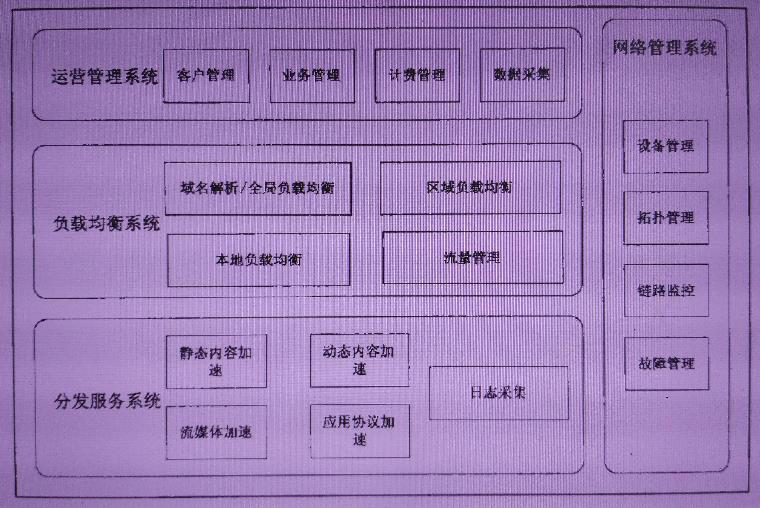

# 计算机网络

## 网络七层架构

7层模型主要包括：

1. **物理层**：主要定义物理设备标准，如网线的接口类型、光纤的接口类型、各种传输介质的传输速率等。它的主要作用是传输比特流（就是由 1/0 转化为电流强弱来进行传输,到达目的地后在转化为1/0，也就是我们常说的模数转换与数模转换）。这一层的数据叫做比特。 
2. **数据链路层**：主要将从物理层接收的数据进行MAC地址（网卡的地址）的封装与解封装。常把这一层的数据叫做帧。在这一层工作的设备是交换机，数据通过交换机来传输。
3. **网络层**：主要将从下层接收到的数据进行IP地址（例 192.168.0.1）的封装与解封装。在这一层工作的设备是路由器，常把这一层的数据叫做数据包。
4. **传输层**：定义了一些传输数据的协议和端口号（WWW 端口80等）。如：TCP（传输控制协议，传输效率低，可靠性强，用于传输可靠性要求高，数据量大的数据）；UDP（用户数据报协议，与TCP特性恰恰相反，用于传输可靠性要求不高，数据量小的数据，如QQ聊天数据就是通过这种方式传输的）。 主要是将从下层接收的数据进行分段进行传输，到达目的地址后在进行重组。常常把这一层数据叫做段。 
5. **会话层**：通过传输层（端口号：传输端口与接收端口）建立数据传输的通路。主要在你的系统之间发起会话或或者接受会话请求（设备之间需要互相认识可以是IP也可以是MAC或者是主机名）。
6. **表示层**：主要是进行对接收的数据进行解释、加密与解密、压缩与解压缩等（也就是把计算机能够识别的东西转换成人能够能识别的东西（如图片、声音等）） 。
7. **应用层**： 主要是一些终端的应用，比如说FTP（各种文件下载），WEB（IE浏览），QQ之类的（你就把它理解成我们在电脑屏幕上可以看到的东西。就是终端应用）。


http://www.colasoft.com.cn/download.php


## TCP/IP原理

TCP/IP协议不是TCP和IP这两个协议的合称，而是指因特网整个TCP/IP协议族。从协议分层模型方面来讲，TCP/IP由四个层次组成：网络接口层、网络层、传输层、应用层。


**网络访问层(Network Access Layer)**

网络访问层(Network Access Layer)在 TCP/IP 参考模型中并没有详细描述，只是指出主机必须使用某种协议与网络相连。

**网络层(Network Layer)**

网络层(Internet Layer)是整个体系结构的关键部分，其功能是使主机可以把分组发往任何网络，并使分组独立地传向目标。这些分组可能经由不同的网络，到达的顺序和发送的顺序也可能不同。高层如果需要顺序收发，那么就必须自行处理对分组的排序。互联网层使用因特网协议(IP，Internet Protocol)。

**传输层(Tramsport Layer-TCP/UDP)**

传输层(Tramsport Layer)使源端和目的端机器上的对等实体可以进行会话。在这一层定义了两个端到端的协议：传输控制协议(TCP，Transmission Control Protocol)和用户数据报协议(UDP，User Datagram Protocol)。TCP 是面向连接的协议，它提供可靠的报文传输和对上层应用的连接服务。为此，除了基本的数据传输外，它还有可靠性保证、流量控制、多路复用、优先权和安全性控制等功能。UDP 是面向无连接的不可靠传输的协议，主要用于不需要 TCP 的排序和流量控制等功能的应用程序。

**应用层(Application Layer)**

应用层(Application Layer)包含所有的高层协议，包括：虚拟终端协议(TELNET，TELecommunications NETwork)、文件传输协议(FTP，File Transfer Protocol)、电子邮件传输协议(SMTP，Simple Mail Transfer Protocol)、域名服务(DNS，Domain Name Service)、网上新闻传输协议(NNTP，Net News Transfer Protocol)和超文本传送协议(HTTP，HyperText Transfer Protocol)等。


## TCP三次握手/四次挥手

TCP 在传输之前会进行三次沟通，一般称为“三次握手”，传完数据断开的时候要进行四次沟通，一般称为“四次挥手”。

### 数据包说明

1. **源端口号（16位）：**它（连同源主机IP地址）标识源主机的一个应用进程。

2. **目的端口号（16位）：**它（连同目的主机IP地址）标识目的主机的一个应用进程。这两个值加上IP报头中的源主机IP地址和目的主机IP地址唯一确定一个TCP连接。

3. **顺序号seq（32位）：**用来标识从TCP源端向TCP目的端发送的数据字节流，它表示在这个报文段中的第一个数据字节的顺序号。如果将字节流看作在两个应用程序间的单向流动，则TCP用顺序号对每个字节进行计数。序号是32bit的无符号数，序号到达2的32次方-1后又从0开始。当建立一个新的连接时，SYN标志变1 ，顺序号字段包含由这个主机选择的该连接的初始顺序号 ISN（ Initial Sequence Number ）。

4. **确认号ack（32位）：**包含发送确认的一端所期望收到的下一个顺序号。因此，确认序号应当是上次已成功收到数据字节顺序号加1 。只有ACK标志为1时确认序号字段才有效。TCP为应用层提供全双工服务，这意味数据能在两个方向上独立地进行传输。因此，连接的每一端必须保持每个方向上的传输数据顺序号。

5. **TCP报头长度（4位）：**给出报头中 32bit 字的数目，它实际上指明数据从哪里开始。需要这个值是因为任选字段的长度是可变的。这个字段占4bit ，因此TCP最多有60字节的首部。然而，没有任选字段，正常的长度是 20 字节。

6. **保留位（6位）：**保留给将来使用，目前必须置为0 。

7. **控制位（control flags，6位）：**在TCP报头中有6个标志比特，它们中的多个可同时被设置为1 。依次为：
- **URG：**为 1 表示紧急指针有效，为 0 则忽略紧急指针值。
  
- **ACK：**为 1 表示确认号有效，为 0 表示报文中不包含确认信息，忽略确认号字段。
  
- **PSH：**为 1 表示是带有 PUSH 标志的数据，指示接收方应该尽快将这个报文段交给应用层而不用等待缓冲区装满。
  
- **RST：**用于复位由于主机崩溃或其他原因而出现错误的连接。它还可以用于拒绝非法的报文段和拒绝连接请求。一般情况下，如果收到一个 RST 为 1 的报文，那么一定发生了某些问题。
  
- **SYN：**同步序号，为 1 表示连接请求，用于建立连接和使顺序号同步（synchronize）。
  
- **FIN：**用于释放连接，为 1 表示发送方已经没有数据发送了，即关闭本方数据流。
  
8. **窗口大小（16位）：**数据字节数，表示从确认号开始，本报文的源方可以接收的字节数，即源方接收窗口大小。窗口大小是一个 16bit 字段，因而窗口大小最大为 65535 字节。

9. **校验和（16位）：**此校验和是对整个的 TCP 报文段，包括 TCP 头部和 TCP 数据，以 16 位字进行计算所得。这是一个强制性的字段，一定是由发送端计算和存储，并由接收端进行验证。

10. **紧急指针（16位）：**只有当 URG 标志置 1 时紧急指针才有效。TCP 的紧急方式是发送端向另一端发送紧急数据的一种方式。

11. **选项：**最常见的可选字段是最长报文大小，又称为 MSS(Maximum Segment Size) 。每个连接方通常都在通信的第一个报文段（为建立连接而设置 SYN 标志的那个段）中指明这个选项，它指明本端所能接收的最大长度的报文段。选项长度不一定是 32 位字的整数倍，所以要加填充位，使得报头长度成为整字数。

12. **数据：** TCP 报文段中的数据部分是可选的。在一个连接建立和一个连接终止时，双方交换的报文段仅有 TCP 首部。如果一方没有数据要发送，也使用没有任何数据的首部来确认收到的数据。在处理超时的许多情况中，也会发送不带任何数据的报文段。


### 三次握手

第一次握手：主机A发送位码为 syn＝1,随机产生seq number=1234567的数据包到服务器，主机B由SYN=1知道，A 要求建立联机；

第二次握手：主机B收到请求后要确认联机信息，向A发送ack number=(主机A的seq+1),syn=1,ack=1,随机产生seq=7654321的包；

第三次握手：主机A收到后检查 ack number 是否正确，即第一次发送的 seq number+1,以及位码ack是否为1，若正确，主机A会再发送 ack number=(主机B的 seq+1),ack=1，主机B收到后确认seq 值与 ack=1 则连接建立成功。


### 四次挥手

TCP 建立连接要进行三次握手，而断开连接要进行四次。这是由于 TCP 的半关闭造成的。因为 TCP 连接是全双工的(即数据可在两个方向上同时传递)所以进行关闭时每个方向上都要单独进行关闭。这个单方向的关闭就叫半关闭。当一方完成它的数据发送任务，就发送一个 FIN 来向另一方通告将要终止这个方向的连接。

1） 关闭客户端到服务器的连接：首先客户端 A 发送一个 FIN，用来关闭客户到服务器的数据传送，然后等待服务器的确认。其中终止标志位 FIN=1，序列号 seq=u。

2） 服务器收到这个 FIN，它发回一个 ACK，确认号 ack 为收到的序号加 1。

3） 关闭服务器到客户端的连接：也是发送一个 FIN 给客户端。

4） 客户端收到 FIN 后，并发回一个 ACK 报文确认，并将确认序号 seq 设置为收到序号加 1。 首先进行关闭的一方将执行主动关闭，而另一方执行被动关闭。


主机 A 发送 FIN 后，进入终止等待状态， 服务器 B 收到主机 A 连接释放报文段后，就立即给主机 A 发送确认，然后服务器 B 就进入 close-wait 状态，此时 TCP 服务器进程就通知高层应用进程，因而从 A 到 B 的连接就释放了。此时是“半关闭”状态。即 A 不可以发送给B，但是 B 可以发送给 A。此时，若 B 没有数据报要发送给 A 了，其应用进程就通知 TCP 释放连接，然后发送给 A 连接释放报文段，并等待确认。A 发送确认后，进入 time-wait，注意，此时 TCP 连接还没有释放掉，然后经过时间等待计时器设置的2MSL 后，A 才进入到close 状态。

## HTTP原理

HTTP 是一个无状态的协议。无状态是指客户机（Web 浏览器）和服务器之间不需要建立持久的连接，这意味着当一个客户端向服务器端发出请求，然后服务器返回响应(response)，连接就被关闭了，在服务器端不保留连接的有关信息.HTTP 遵循请求(Request)/应答(Response)模型。客户机（浏览器）向服务器发送请求，服务器处理请求并返回适当的应答。所有 HTTP 连接都被构造成一套请求和应答。

### 传输流程

#### 1.地址解析

如用客户端浏览器请求这个页面：http://localhost.com:8080/index.htm 从中分解出协议名、主机名、端口、对象路径等部分，对于我们的这个地址，解析得到的结果如下：

```
协议名：http
主机名：localhost.com
端口：8080
对象路径：/index.htm
```

在这一步，需要域名系统DNS解析域名localhost.com，得到主机的ip地址。

#### 2.封装HTTP请求数据包

把以上部分结合本机信息，封装成一个HTTP请求数据包。

#### 3.封装成TCP包并建立连接

封装成TCP包，建立TCP连接。（TCP的三次握手）

#### 4.客户机发送请求命令

建立连接后，客户机发送一个请求给服务器，请求方式的格式为：统一资源标识符（URL）、协议版本号，后边是 MIME 信息包括请求修饰符、客户机信息和可内容。

#### 5.服务器响应

服务器接到请求后，给予相应的响应信息，其格式为一个状态行，包括信息的协议版本号、一个成功或错误的代码，后边是 MIME 信息包括服务器信息、实体信息和可能的内容。 

#### 6.服务器关闭TCP连接

一般情况下，一旦 Web 服务器向浏览器发送了请求数据，它就要关闭 TCP 连接，然后如果浏览器或者服务器在其头信息加入了这行代码 Connection:keep-alive，TCP 连接在发送后将仍然保持打开状态，于是，浏览器可以继续通过相同的连接发送请求。保持连接节省了为每个请求建立新连接所需的时间，还节约了网络带宽。


### HTTP状态

| 状态码  | 原因语句                                          |
| ------- | ------------------------------------------------- |
| **1xx** | **消息响应**                                      |
| 100     | Cuntinue(继续)                                    |
| 101     | Switching Protocol(转换协议)                      |
| **2xx** | **成功响应**                                      |
| 200     | OK(成功)                                          |
| 201     | Create(已创建)                                    |
| 202     | Accepted(已创建)                                  |
| 203     | Non-Authoritative Information(未授权信息)         |
| 204     | No Content(无内容)                                |
| 205     | Reset Content(重置内容)                           |
| 206     | Partial Content(部分内容)                         |
| **3xx** | **重定向**                                        |
| 300     | Multiple Choice(多种选择)                         |
| 301     | Moved Permanently(永久移动)                       |
| 302     | Found(临时移动)                                   |
| 303     | See Other(查看其他位置)                           |
| 304     | Not Modified(未修改)                              |
| 305     | Use Proxy(使用代理)                               |
| 306     | unused*(未使用)                                   |
| 307     | Temporary Redirect(临时重定向)                    |
| 308     | Permanent Redirect(永久重定向)                    |
| **4xx** | **客户端错误**                                    |
| 400     | Bad Request(错误请求)                             |
| 401     | Unauthorized(未授权)                              |
| 402     | Payment Required(需要付款)                        |
| 403     | Forbidden(禁止访问)                               |
| 404     | Not Found(未找到)                                 |
| 405     | Method Not Allowed(不允许使用该方法)              |
| 406     | Not Acceptable(无法接受)                          |
| 407     | Proxy Authentication Required(要求代理身份验证)   |
| 408     | Request Timeout(请求超时)                         |
| 409     | Conflict(冲突)                                    |
| 410     | Gone(已失效)                                      |
| 411     | Length Required(需要内容长度头)                   |
| 412     | Precondition Failed(预处理失败)                   |
| 413     | Request Entity Too Large(请求实体过长)            |
| 414     | Request-URI Too Long(请求网址过长)                |
| 415     | Unsupported Media Type(媒体类型不支持)            |
| 416     | Requested Range Not Satisfiable(请求范围不合要求) |
| 417     | Expectation Failed(预期结果失败)                  |
| **5xx** | **服务端错误**                                    |
| 500     | Internal Server Error(内部服务器错误)             |
| 501     | Implemented(未实现)                               |
| 502     | Bad Gateway(网关错误)                             |
| 503     | Service Unavailable(服务不可用)                   |
| 504     | Gateway Timeout (网关超时)                        |
| 505     | HTTP Version Not Supported(HTTP 版本不受支持)     |


### HTTPS

HTTPS（全称：Hypertext Transfer Protocol over Secure Socket Layer），是以安全为目标的HTTP通道，简单讲是HTTP的安全版。即HTTP下加入 SSL 层，HTTPS的安全基础是SSL。其所用的端口号是443。 过程大致如下：

#### 建立连接获取证书

 SSL 客户端通过 TCP 和服务器建立连接之后（443 端口），并且在一般的 tcp 连接协商（握手）过程中请求证书。即客户端发出一个消息给服务器，这个消息里面包含了自己可实现的算法列表和其它一些需要的消息，SSL 的服务器端会回应一个数据包，这里面确定了这次通信所需要的算法，然后服务器向客户端返回证书。（证书里面包含了服务器信息：域名。申请证书的公司，公共秘钥）。

#### 证书验证

 Client 在收到服务器返回的证书后，判断签发这个证书的公共签发机构，并使用这个机构的公共秘钥确认签名是否有效，客户端还会确保证书中列出的域名就是它正在连接的域名。

#### 数据加密和传输

如果确认证书有效，那么生成对称秘钥并使用服务器的公共秘钥进行加密。然后发送给服务器，服务器使用它的私钥对它进行解密，这样两台计算机可以开始进行对称加密进行通信。


## CDN原理

CND 一般包含分发服务系统、负载均衡系统和管理系统

#### 分发服务系统

其基本的工作单元就是各个 Cache 服务器。负责直接响应用户请求，将内容快速分发到用户；同时还负责内容更新，保证和源站内容的同步。

根据内容类型和服务种类的不同，分发服务系统分为多个子服务系统，如：网页加速服务、流媒体加速服务、应用加速服务等。每个子服务系统都是一个分布式的服务集群，由功能类似、地域接近的分布部署的 Cache 集群组成。

在承担内容同步、更新和响应用户请求之外，分发服务系统还需要向上层的管理调度系统反馈各个Cache 设备的健康状况、响应情况、内容缓存状况等，以便管理调度系统能够根据设定的策略决定由哪个 Cache 设备来响应用户的请求。

#### 负载均衡系统

负载均衡系统是整个 CDN 系统的中枢。负责对所有的用户请求进行调度，确定提供给用户的最终访问地址。使用分级实现。最基本的两极调度体系包括全局负载均衡（GSLB）和本地负载均衡（SLB）。GSLB 根据用户地址和用户请求的内容，主要根据就近性原则，确定向用户服务的节点。一般通过 DNS解析或者应用层重定向（Http 3XX 重定向）的方式实现。SLB 主要负责节点内部的负载均衡。当用户请求从 GSLB 调度到 SLB 时，SLB 会根据节点内各个Cache 设备的工作状况和内容分布情况等对用户请求重定向。SLB 的实现有四层调度（LVS）、七层调度（Nginx）和链路负载调度等。

#### 管理系统

分为运营管理和网络管理子系统。网络管理系统实现对 CDN 系统的设备管理、拓扑管理、链路监控和故障管理，为管理员提供对全网资源的可视化的集中管理，通常用 web 方式实现。运营管理是对 CDN 系统的业务管理，负责处理业务层面的与外界系统交互所必须的一些收集、整理、交付工作。包括用户管理、产品管理、计费管理、统计分析等。




## 网络攻击

#### 1.SYN Flood 攻击

关于 SYN Flood 攻击。一些恶意的人就为此制造了 SYN Flood 攻击——给服务器发了 一个 SYN 后，就下线了，于是服务器需要默认等 63s 才会断开连接，这样，攻击者就可以 把服务器的 syn 连接的队列耗尽，让正常的连接请求不能处理。于是，Linux 下给了一个叫 tcp_syncookies 的参数来应对这个事——当 SYN 队列满了后，TCP 会通过源地址端口、目 标地址端口和时间戳打造出一个特别的 Sequence Number 发回去（又叫 cookie），如果是攻击者则不会有响应，如果是正常连接，则会把这个 SYN Cookie 发回来，然后服务端可以通过 cookie 建连接（即使你不在 SYN 队列中）。请注意，请先千万别用 tcp_syncookies来处理正常的大负载的连接的情况。因为，synccookies 是妥协版的 TCP 协议，并不严谨。对于正常的请求，你应该调整三个 TCP 参数可供你选择，第一个是：tcp_synack_retries 可 以用他来减少重试次数；第二个是：tcp_max_syn_backlog，可以增大 SYN 连接数；第三个是：tcp_abort_on_overflow 处理不过来干脆就直接拒绝连接了。 

#### 2.DDOS攻击

DDoS 攻击是 Distributed Denial of Service 的缩写，即不法黑客组织通过控制服务器等资源，发动对包括国家骨干网络、重要网络设施、政企或个人网站在内的互联网上任一目标的攻击，致使目标服务器断网，最终停止提供服务。预防:1.高防服务器 主要是指能独立硬防御 50Gbps 以上的服务器，能够帮助网站拒绝服务攻击，定期扫描网络主节点等 2.DDoS 清洗会对用户请求数据进行实时监控，及时 发现 DOS 攻击等异常流量，在不影响正常业务开展的情况下清洗掉这些异常流量。3.CDN加速 在现实中，CDN 服务将网站访问流量分配到了各个节点中，这样一方面隐藏网站的真实 IP，另一方面即使遭遇 DDoS 攻击，也可以将流量分散到各个节点中，防止源站崩溃。

#### 3.DNS欺骗 

DNS 欺骗就是攻击者冒充 域名服务器 的一种欺骗行为。预防：1.使用入侵检测系统 2.使用 DNSSEC 

#### 4.重放攻击

重放攻击又称重播攻击、回放攻击，是指攻击者发送一个目的主机已接收过的包，来达到欺骗系统的目的，主要用于身份认证过程，破坏认证的正确性。预防：1.加随机数 2.加时间戳。

#### 5.SQL注入

所谓 SQL 注入，就是通过把 SQL 命令插入到 Web 表单提交或输入域名或页面请求的 查询字符串，最终达到欺骗服务器执行恶意的 SQL 命令。预防：

1.**加密处理** 将用户登录名称、密码等数据加密保存。加密用户输入的数据，然后再将它与数据库中保存的数据比较，这相当于对用户输入的数据进行了“消毒”处理，用户输入的数据不再对数据库有任何特殊的意义，从而也就防止了攻击者注入 SQL 命令。 

**2.确保数据库安全** 只给访问数据库的 web 应用功能所需的最低的权限，撤销不必要的公共许可 

3.**输入验证** 检查用户输入的合法性，确信输入的内容只包含合法的数据。数据检查应当在客户端和服务器端都执行之所以要执行服务器端验证，是为了弥补客户端验证机制脆弱的安全性。


## 面试题

在浏览器中输入url地址->>显示主页的过程。

HTTP长连接，短连接。

Cookie和Session的作用？两者有什么区别？

HTTP1.0和HTTP1.1的主要区别是什么？

URI和URL的区别是什么？

HTTP和HTTPS的区别？

TCP和UDP协议的区别？


# Java NIO

http://tutorials.jenkov.com/java-nio/index.html

## Java NIO教程

Java NIO(New IO)是一个可以替代标准Java IO API的IO API（从Java 1.4开始)，Java NIO提供了与标准IO不同的IO工作方式。

**Java NIO: Channels and Buffers（通道和缓冲区）**

标准的IO基于字节流和字符流进行操作的，而NIO是基于通道（Channel）和缓冲区（Buffer）进行操作，数据总是从通道读取到缓冲区中，或者从缓冲区写入到通道中。

**Java NIO: Non-blocking IO（非阻塞IO）**

Java NIO可以让你非阻塞的使用IO，例如：当线程从通道读取数据到缓冲区时，线程还是可以进行其他事情。当数据被写入到缓冲区时，线程可以继续处理它。从缓冲区写入通道也类似。

**Java NIO: Selectors（选择器）**

Java NIO引入了选择器的概念，选择器用于监听多个通道的事件（比如：连接打开，数据到达）。因此，单个的线程可以监听多个数据通道。

**Java NIO Concepts(Java NIO 概念)**

与旧的 Java IO 模型相比，在 Java NIO 中需要学习几个新概念。 这些概念在下面列出：

- [Channels(通道)](http://tutorials.jenkov.com/java-nio/channels.html)
- [Buffers(缓冲区)](http://tutorials.jenkov.com/java-nio/buffers.html)
- [Scatter - Gather(分散-聚集)](http://tutorials.jenkov.com/java-nio/scatter-gather.html)
- [Channel to Channel Transfers(通道之间的数据传输)](http://tutorials.jenkov.com/java-nio/channel-to-channel-transfers.html)
- [Selectors(选择器)](http://tutorials.jenkov.com/java-nio/selectors.html)
- [FileChannel(文件通道)](http://tutorials.jenkov.com/java-nio/file-channel.html)
- [SocketChannel(TCP套接字通道)](http://tutorials.jenkov.com/java-nio/socketchannel.html)
- [ServerSocketChannel(可以监听新进来的TCP连接通道)](http://tutorials.jenkov.com/java-nio/server-socket-channel.html)
- [Non-blocking Server Design(非阻塞式服务设计)](http://tutorials.jenkov.com/java-nio/non-blocking-server.html)
- [DatagramChannel(收发UDP通道)](http://tutorials.jenkov.com/java-nio/datagram-channel.html)
- [Pipe(管道)](http://tutorials.jenkov.com/java-nio/pipe.html)
- [NIO vs. IO](http://tutorials.jenkov.com/java-nio/nio-vs-io.html)
- [Path(文件系统路径)](http://tutorials.jenkov.com/java-nio/path.html)
- [Files(操作文件的类)](http://tutorials.jenkov.com/java-nio/files.html)
- [AsynchronousFileChannel(异步读取和写入文件数据)](http://tutorials.jenkov.com/java-nio/asynchronousfilechannel.html)


## (一)、Java NIO概述

Java NIO 由以下几个核心部分组成：

- Channels
- Buffers
- Selectors

虽然Java NIO 中除此之外还有很多类和组件，但在我看来，Channel，Buffer 和 Selector 构成了核心的API。其它组件，如Pipe和FileLock，只不过是与三个核心组件共同使用的工具类。因此，在概述中我将集中在这三个组件上。其它组件会在单独的章节中讲到。

### Channel 和 Buffer

基本上，所有的 IO 在NIO 中都从一个Channel 开始。Channel 有点象流。 数据可以从Channel读到Buffer中，也可以从Buffer 写到Channel中。这里有个图示：


Channel和Buffer有好几种类型。下面是JAVA NIO中的一些主要Channel的实现：

- FileChannel
- DatagramChannel
- SocketChannel
- ServerSocketChannel

正如你所看到的，这些通道涵盖了UDP 和 TCP 网络IO，以及文件IO。

与这些类一起的有一些有趣的接口，但为简单起见，我尽量在概述中不提到它们。本教程其它章节与它们相关的地方我会进行解释。

以下是Java NIO里关键的Buffer实现：

- ByteBuffer
- CharBuffer
- DoubleBuffer
- FloatBuffer
- IntBuffer
- LongBuffer
- ShortBuffer

这些Buffer覆盖了你能通过IO发送的基本数据类型：byte, short, int, long, float, double 和 char。

Java NIO 还有个 MappedByteBuffer，用于表示内存映射文件， 我也不打算在概述中说明。

### Selectors

Selector允许单线程处理多个 Channel。如果你的应用打开了多个连接（通道），但每个连接的流量都很低，使用Selector就会很方便。例如，在一个聊天服务器中。

这是在一个单线程中使用一个Selector处理3个Channel的图示：


要使用Selector，得向Selector注册Channel，然后调用它的select()方法。这个方法会一直阻塞到某个注册的通道有事件就绪。一旦这个方法返回，线程就可以处理这些事件，事件的例子有如新连接进来，数据接收等。


## (二)、Channel

Java NIO的通道类似流，但又有些不同：

- 既可以从通道中读取数据，又可以写数据到通道。但流的读写通常是单向的。
- 通道可以异步地读写。
- 通道中的数据总是要先读到一个Buffer，或者总是要从一个Buffer中写入。

正如上面所说，从通道读取数据到缓冲区，从缓冲区写入数据到通道。如下图所示：


### Channel的实现

这些是Java NIO中最重要的通道的实现：

- FileChannel
- DatagramChannel
- SocketChannel
- ServerSocketChannel

FileChannel 从文件中读写数据。

DatagramChannel 能通过UDP读写网络中的数据。

SocketChannel 能通过TCP读写网络中的数据。

ServerSocketChannel可以监听新进来的TCP连接，像Web服务器那样。对每一个新进来的连接都会创建一个SocketChannel。

### 基本的 Channel 示例

下面是一个使用FileChannel读取数据到Buffer中的示例：

```java
RandomAccessFile aFile = new RandomAccessFile("data/nio-data.txt", "rw");
FileChannel inChannel = aFile.getChannel();

ByteBuffer buf = ByteBuffer.allocate(48);

int bytesRead = inChannel.read(buf);
while (bytesRead != -1) {

    System.out.println("Read " + bytesRead);
    buf.flip();

    while (buf.hasRemaining()) {
        System.out.print((char) buf.get());
    }

    buf.clear();
    bytesRead = inChannel.read(buf);
}
aFile.close();
```

注意 buf.flip() 的调用，首先读取数据到Buffer，然后反转Buffer,接着再从Buffer中读取数据。下一节会深入讲解Buffer的更多细节。

## (三)、Buffer

Java NIO中的Buffer用于和NIO通道进行交互。如你所知，数据是从通道读入缓冲区，从缓冲区写入到通道中的。

缓冲区本质上是一块可以写入数据，然后可以从中读取数据的内存。这块内存被包装成NIO Buffer对象，并提供了一组方法，用来方便的访问该块内存。

下面是NIO Buffer相关的话题列表：

1. [Buffer的基本用法](https://ifeve.com/buffers/#basicusage)
2. [Buffer的capacity,position和limit](https://ifeve.com/buffers/#cap-pos-limit)
3. [Buffer的类型](https://ifeve.com/buffers/#buffertype)
4. [Buffer的分配](https://ifeve.com/buffers/#allocate)
5. [向Buffer中写数据](https://ifeve.com/buffers/#writetobuffer)
6. [flip()方法](https://ifeve.com/buffers/#flip)
7. [从Buffer中读取数据](https://ifeve.com/buffers/#read)
8. [clear()与compact()方法](https://ifeve.com/buffers/#clearandcompact)
9. [mark()与reset()方法](https://ifeve.com/buffers/#markandreset)
10. [equals()与compareTo()方法](https://ifeve.com/buffers/#equalsandcompareto)

### Buffer的基本用法

使用Buffer读写数据一般遵循以下四个步骤：

1. 写入数据到Buffer
2. 调用`flip()`方法
3. 从Buffer中读取数据
4. 调用`clear()`方法或者`compact()`方法

当向buffer写入数据时，buffer会记录下写了多少数据。一旦要读取数据，需要通过flip()方法将Buffer从写模式切换到读模式。在读模式下，可以读取之前写入到buffer的所有数据。

一旦读完了所有的数据，就需要清空缓冲区，让它可以再次被写入。有两种方式能清空缓冲区：调用clear()或compact()方法。clear()方法会清空整个缓冲区。compact()方法只会清除已经读过的数据。任何未读的数据都被移到缓冲区的起始处，新写入的数据将放到缓冲区未读数据的后面。

下面是一个使用Buffer的例子：

```java
RandomAccessFile aFile = new RandomAccessFile("data/nio-data.txt", "rw");
FileChannel inChannel = aFile.getChannel();

//create buffer with capacity of 48 bytes
ByteBuffer buf = ByteBuffer.allocate(48);

int bytesRead = inChannel.read(buf); //read into buffer.
while (bytesRead != -1) {

    buf.flip();  //make buffer ready for read

    while (buf.hasRemaining()) {
        System.out.print((char) buf.get()); // read 1 byte at a time
    }

    buf.clear(); //make buffer ready for writing
    bytesRead = inChannel.read(buf);
}
aFile.close();
```

### Buffer的capacity,position和limit

缓冲区本质上是一块可以写入数据，然后可以从中读取数据的内存。这块内存被包装成NIO Buffer对象，并提供了一组方法，用来方便的访问该块内存。

为了理解Buffer的工作原理，需要熟悉它的三个属性：

- capacity
- position
- limit

position和limit的含义取决于Buffer处在读模式还是写模式。不管Buffer处在什么模式，capacity的含义总是一样的。

这里有一个关于capacity，position和limit在读写模式中的说明，详细的解释在插图后面。


#### capacity

作为一个内存块，Buffer有一个固定的大小值，也叫“capacity”.你只能往里写capacity个byte、long，char等类型。一旦Buffer满了，需要将其清空（通过读数据或者清除数据）才能继续写数据往里写数据。

#### position

当你写数据到Buffer中时，position表示当前的位置。初始的position值为0.当一个byte、long等数据写到Buffer后， position会向前移动到下一个可插入数据的Buffer单元。position最大可为capacity – 1.

当读取数据时，也是从某个特定位置读。当将Buffer从写模式切换到读模式，position会被重置为0. 当从Buffer的position处读取数据时，position向前移动到下一个可读的位置。

#### limit

在写模式下，Buffer的limit表示你最多能往Buffer里写多少数据。 写模式下，limit等于Buffer的capacity。

当切换Buffer到读模式时， limit表示你最多能读到多少数据。因此，当切换Buffer到读模式时，limit会被设置成写模式下的position值。换句话说，你能读到之前写入的所有数据（limit被设置成已写数据的数量，这个值在写模式下就是position）

### Buffer的类型

Java NIO 有以下Buffer类型

- ByteBuffer
- MappedByteBuffer
- CharBuffer
- DoubleBuffer
- FloatBuffer
- IntBuffer
- LongBuffer
- ShortBuffer


如你所见，这些Buffer类型代表了不同的数据类型。换句话说，就是可以通过char，short，int，long，float 或 double类型来操作缓冲区中的字节。

MappedByteBuffer 有些特别，在涉及它的专门章节中再讲。

### Buffer的分配

要想获得一个Buffer对象首先要进行分配。 每一个Buffer类都有一个allocate方法。下面是一个分配48字节capacity的ByteBuffer的例子。

```java
ByteBuffer buf = ByteBuffer.allocate(48);
```

这是分配一个可存储1024个字符的CharBuffer：

```java
CharBuffer buf = CharBuffer.allocate(1024);
```

### 向Buffer中写数据

写数据到Buffer有两种方式：

- 从Channel写到Buffer。
- 通过Buffer的put()方法写到Buffer里。

从Channel写到Buffer的例子

```java
int bytesRead = inChannel.read(buf); //read into buffer.
```

通过put方法写Buffer的例子：

```java
buf.put(127);
```

put方法有很多版本，允许你以不同的方式把数据写入到Buffer中。例如， 写到一个指定的位置，或者把一个字节数组写入到Buffer。 更多Buffer实现的细节参考JavaDoc。

#### flip()方法

flip方法将Buffer从写模式切换到读模式。调用flip()方法会将position设回0，并将limit设置成之前position的值。

换句话说，position现在用于标记读的位置，limit表示之前写进了多少个byte、char等 —— 现在能读取多少个byte、char等。

### 从Buffer中读取数据

从Buffer中读取数据有两种方式：

1. 从Buffer读取数据到Channel。
2. 使用get()方法从Buffer中读取数据。

从Buffer读取数据到Channel的例子：

```java
//read from buffer into channel.
int bytesWritten = inChannel.write(buf);
```

使用get()方法从Buffer中读取数据的例子

```java
byte aByte = buf.get();
```

get方法有很多版本，允许你以不同的方式从Buffer中读取数据。例如，从指定position读取，或者从Buffer中读取数据到字节数组。更多Buffer实现的细节参考JavaDoc。

### rewind()方法

Buffer.rewind()将position设回0，所以你可以重读Buffer中的所有数据。limit保持不变，仍然表示能从Buffer中读取多少个元素（byte、char等）。

### clear()与compact()方法

一旦读完Buffer中的数据，需要让Buffer准备好再次被写入。可以通过clear()或compact()方法来完成。

如果调用的是clear()方法，position将被设回0，limit被设置成 capacity的值。换句话说，Buffer 被清空了。Buffer中的数据并未清除，只是这些标记告诉我们可以从哪里开始往Buffer里写数据。

如果Buffer中有一些未读的数据，调用clear()方法，数据将“被遗忘”，意味着不再有任何标记会告诉你哪些数据被读过，哪些还没有。

如果Buffer中仍有未读的数据，且后续还需要这些数据，但是此时想要先先写些数据，那么使用compact()方法。

compact()方法将所有未读的数据拷贝到Buffer起始处。然后将position设到最后一个未读元素正后面。limit属性依然像clear()方法一样，设置成capacity。现在Buffer准备好写数据了，但是不会覆盖未读的数据。

### mark()与reset()方法

通过调用Buffer.mark()方法，可以标记Buffer中的一个特定position。之后可以通过调用Buffer.reset()方法恢复到这个position。例如：

```java
buffer.mark();

//call buffer.get() a couple of times, e.g. during parsing.

buffer.reset();  //set position back to mark.
```

### equals()与compareTo()方法

可以使用equals()和compareTo()方法两个Buffer。

#### equals()

当满足下列条件时，表示两个Buffer相等：

1. 有相同的类型（byte、char、int等）。
2. Buffer中剩余的byte、char等的个数相等。
3. Buffer中所有剩余的byte、char等都相同。

如你所见，equals只是比较Buffer的一部分，不是每一个在它里面的元素都比较。实际上，它只比较Buffer中的剩余元素。

#### compareTo()方法

compareTo()方法比较两个Buffer的剩余元素(byte、char等)， 如果满足下列条件，则认为一个Buffer“小于”另一个Buffer：

1. 第一个不相等的元素小于另一个Buffer中对应的元素 。
2. 所有元素都相等，但第一个Buffer比另一个先耗尽(第一个Buffer的元素个数比另一个少)。

*（译注：剩余元素是从 position到limit之间的元素）*

## (四)、Scatter/Cather

Java NIO开始支持scatter/gather，scatter/gather用于描述从Channel（译者注：Channel在中文经常翻译为通道）中读取或者写入到Channel的操作。
分散（scatter）从Channel中读取是指在读操作时将读取的数据写入多个buffer中。因此，Channel将从Channel中读取的数据“分散（scatter）”到多个Buffer中。
聚集（gather）写入Channel是指在写操作时将多个buffer的数据写入同一个Channel，因此，Channel 将多个Buffer中的数据“聚集（gather）”后发送到Channel。

scatter / gather经常用于需要将传输的数据分开处理的场合，例如传输一个由消息头和消息体组成的消息，你可能会将消息体和消息头分散到不同的buffer中，这样你可以方便的处理消息头和消息体。

### **Scattering Reads**

Scattering Reads是指数据从一个channel读取到多个buffer中。如下图描述：


代码示例如下：

```java
ByteBuffer header = ByteBuffer.allocate(128);
ByteBuffer body   = ByteBuffer.allocate(1024);

ByteBuffer[] bufferArray = { header, body };

channel.read(bufferArray);
```

注意buffer首先被插入到数组，然后再将数组作为channel.read() 的输入参数。read()方法按照buffer在数组中的顺序将从channel中读取的数据写入到buffer，当一个buffer被写满后，channel紧接着向另一个buffer中写。

Scattering Reads在移动下一个buffer前，必须填满当前的buffer，这也意味着它不适用于动态消息(译者注：消息大小不固定)。换句话说，如果存在消息头和消息体，消息头必须完成填充（例如 128byte），Scattering Reads才能正常工作。

### **Gathering Writes**

Gathering Writes是指数据从多个buffer写入到同一个channel。如下图描述：


```java
ByteBuffer header = ByteBuffer.allocate(128);
ByteBuffer body   = ByteBuffer.allocate(1024);

//write data into buffers

ByteBuffer[] bufferArray = { header, body };

channel.write(bufferArray);
```

buffers数组是write()方法的入参，write()方法会按照buffer在数组中的顺序，将数据写入到channel，注意只有position和limit之间的数据才会被写入。因此，如果一个buffer的容量为128byte，但是仅仅包含58byte的数据，那么这58byte的数据将被写入到channel中。因此与Scattering Reads相反，Gathering Writes能较好的处理动态消息。

## (五)、通道之间的数据传输

在Java NIO中，如果两个通道中有一个是FileChannel，那你可以直接将数据从一个channel（译者注：channel中文常译作通道）传输到另外一个channel。

### **transferFrom()**

FileChannel的transferFrom()方法可以将数据从源通道传输到FileChannel中（译者注：这个方法在JDK文档中的解释为将字节从给定的可读取字节通道传输到此通道的文件中）。下面是一个简单的例子：

```java
RandomAccessFile fromFile = new RandomAccessFile("fromFile.txt", "rw");
FileChannel      fromChannel = fromFile.getChannel();

RandomAccessFile toFile = new RandomAccessFile("toFile.txt", "rw");
FileChannel      toChannel = toFile.getChannel();

long position = 0;
long count = fromChannel.size();

toChannel.transferFrom(position, count, fromChannel);
```

方法的输入参数position表示从position处开始向目标文件写入数据，count表示最多传输的字节数。如果源通道的剩余空间小于 count 个字节，则所传输的字节数要小于请求的字节数。
此外要注意，在SoketChannel的实现中，SocketChannel只会传输此刻准备好的数据（可能不足count字节）。因此，SocketChannel可能不会将请求的所有数据(count个字节)全部传输到FileChannel中。

### **transferTo()**

transferTo()方法将数据从FileChannel传输到其他的channel中。下面是一个简单的例子：

```java
RandomAccessFile fromFile = new RandomAccessFile("fromFile.txt", "rw");
FileChannel      fromChannel = fromFile.getChannel();

RandomAccessFile toFile = new RandomAccessFile("toFile.txt", "rw");
FileChannel      toChannel = toFile.getChannel();

long position = 0;
long count = fromChannel.size();

fromChannel.transferTo(position, count, toChannel);
```

是不是发现这个例子和前面那个例子特别相似？除了调用方法的FileChannel对象不一样外，其他的都一样。
上面所说的关于SocketChannel的问题在transferTo()方法中同样存在。SocketChannel会一直传输数据直到目标buffer被填满。


## (六)、Selector

Selector（选择器）是Java NIO中能够检测一到多个NIO通道，并能够知晓通道是否为诸如读写事件做好准备的组件。这样，一个单独的线程可以管理多个channel，从而管理多个网络连接。

下面是本文所涉及到的主题列表：

1. [为什么使用Selector?](https://ifeve.com/selectors/#Why)
2. [Selector的创建](https://ifeve.com/selectors/#Creating)
3. [向Selector注册通道](https://ifeve.com/selectors/#Registering)
4. [SelectionKey](https://ifeve.com/selectors/#SelectionKey)
5. [通过Selector选择通道](https://ifeve.com/selectors/#Selecting)
6. [wakeUp()](https://ifeve.com/selectors/#wakeUp)
7. [close()](https://ifeve.com/selectors/#close)
8. [完整的示例](https://ifeve.com/selectors/#Full)


### 为什么使用Selector?

仅用单个线程来处理多个Channels的好处是，只需要更少的线程来处理通道。事实上，可以只用一个线程处理所有的通道。对于操作系统来说，线程之间上下文切换的开销很大，而且每个线程都要占用系统的一些资源（如内存）。因此，使用的线程越少越好。

但是，需要记住，现代的操作系统和CPU在多任务方面表现的越来越好，所以多线程的开销随着时间的推移，变得越来越小了。实际上，如果一个CPU有多个内核，不使用多任务可能是在浪费CPU能力。不管怎么说，关于那种设计的讨论应该放在另一篇不同的文章中。在这里，只要知道使用Selector能够处理多个通道就足够了。

下面是单线程使用一个Selector处理3个channel的示例图：


### Selector的创建

通过调用Selector.open()方法创建一个Selector，如下：

```java
Selector selector = Selector.open();
```

### 向Selector注册通道

为了将Channel和Selector配合使用，必须将channel注册到selector上。通过SelectableChannel.register()方法来实现，如下：

```java
channel.configureBlocking(false);
SelectionKey key = channel.register(selector,Selectionkey.OP_READ);
```

与Selector一起使用时，Channel必须处于非阻塞模式下。这意味着不能将FileChannel与Selector一起使用，因为FileChannel不能切换到非阻塞模式。而套接字通道都可以。

注意register()方法的第二个参数。这是一个“interest集合”，意思是在通过Selector监听Channel时对什么事件感兴趣。可以监听四种不同类型的事件：

1. Connect
2. Accept
3. Read
4. Write

通道触发了一个事件意思是该事件已经就绪。所以，某个channel成功连接到另一个服务器称为“连接就绪”。一个server socket channel准备好接收新进入的连接称为“接收就绪”。一个有数据可读的通道可以说是“读就绪”。等待写数据的通道可以说是“写就绪”。

这四种事件用SelectionKey的四个常量来表示：

1. SelectionKey.OP_CONNECT
2. SelectionKey.OP_ACCEPT
3. SelectionKey.OP_READ
4. SelectionKey.OP_WRITE

如果你对不止一种事件感兴趣，那么可以用“位或”操作符将常量连接起来，如下：

```java
int interestSet = SelectionKey.OP_READ | SelectionKey.OP_WRITE;
```

在下面还会继续提到interest集合。

### SelectionKey

在上一小节中，当向Selector注册Channel时，register()方法会返回一个SelectionKey对象。这个对象包含了一些你感兴趣的属性：

- interest集合
- ready集合
- Channel
- Selector
- 附加的对象（可选）

下面我会描述这些属性。

#### interest集合

就像[向Selector注册通道](https://ifeve.com/selectors/#Registering)一节中所描述的，interest集合是你所选择的感兴趣的事件集合。可以通过SelectionKey读写interest集合，像这样：

```java
int interestSet = selectionKey.interestOps();

boolean isInterestedInAccept  = (interestSet & SelectionKey.OP_ACCEPT) == SelectionKey.OP_ACCEPT；
boolean isInterestedInConnect = interestSet & SelectionKey.OP_CONNECT;
boolean isInterestedInRead    = interestSet & SelectionKey.OP_READ;
boolean isInterestedInWrite   = interestSet & SelectionKey.OP_WRITE;
```

可以看到，用“位与”操作interest 集合和给定的SelectionKey常量，可以确定某个确定的事件是否在interest 集合中。

#### ready集合

ready 集合是通道已经准备就绪的操作的集合。在一次选择(Selection)之后，你会首先访问这个ready set。Selection将在下一小节进行解释。可以这样访问ready集合：

```java
int readySet = selectionKey.readyOps();
```

可以用像检测interest集合那样的方法，来检测channel中什么事件或操作已经就绪。但是，也可以使用以下四个方法，它们都会返回一个布尔类型：

```java
selectionKey.isAcceptable();
selectionKey.isConnectable();
selectionKey.isReadable();
selectionKey.isWritable();
```

#### Channel + Selector

从SelectionKey访问Channel和Selector很简单。如下：

```java
Channel  channel  = selectionKey.channel();
Selector selector = selectionKey.selector();
```

#### 附加的对象

可以将一个对象或者更多信息附着到SelectionKey上，这样就能方便的识别某个给定的通道。例如，可以附加 与通道一起使用的Buffer，或是包含聚集数据的某个对象。使用方法如下：

```java
selectionKey.attach(theObject);
Object attachedObj = selectionKey.attachment();
```

还可以在用register()方法向Selector注册Channel的时候附加对象。如：

```java
SelectionKey key = channel.register(selector, SelectionKey.OP_READ, theObject);
```

### 通过Selector选择通道

一旦向Selector注册了一或多个通道，就可以调用几个重载的select()方法。这些方法返回你所感兴趣的事件（如连接、接受、读或写）已经准备就绪的那些通道。换句话说，如果你对“读就绪”的通道感兴趣，select()方法会返回读事件已经就绪的那些通道。

下面是select()方法：

- int select()
- int select(long timeout)
- int selectNow()

`select()`阻塞到至少有一个通道在你注册的事件上就绪了。

`select(long timeout)`和select()一样，除了最长会阻塞timeout毫秒(参数)。

`selectNow()`不会阻塞，不管什么通道就绪都立刻返回（*译者注：此方法执行非阻塞的选择操作。如果自从前一次选择操作后，没有通道变成可选择的，则此方法直接返回零。*）。

select()方法返回的int值表示有多少通道已经就绪。亦即，自上次调用select()方法后有多少通道变成就绪状态。如果调用select()方法，因为有一个通道变成就绪状态，返回了1，若再次调用select()方法，如果另一个通道就绪了，它会再次返回1。如果对第一个就绪的channel没有做任何操作，现在就有两个就绪的通道，但在每次select()方法调用之间，只有一个通道就绪了。

#### selectedKeys()

一旦调用了select()方法，并且返回值表明有一个或更多个通道就绪了，然后可以通过调用selector的selectedKeys()方法，访问“已选择键集（selected key set）”中的就绪通道。如下所示：

```java
Set selectedKeys = selector.selectedKeys();
```

当像Selector注册Channel时，Channel.register()方法会返回一个SelectionKey 对象。这个对象代表了注册到该Selector的通道。可以通过SelectionKey的selectedKeySet()方法访问这些对象。

可以遍历这个已选择的键集合来访问就绪的通道。如下：

```java
Set selectedKeys = selector.selectedKeys();
Iterator keyIterator = selectedKeys.iterator();
while(keyIterator.hasNext()) {
    SelectionKey key = keyIterator.next();
    if(key.isAcceptable()) {
        // a connection was accepted by a ServerSocketChannel.
    } else if (key.isConnectable()) {
        // a connection was established with a remote server.
    } else if (key.isReadable()) {
        // a channel is ready for reading
    } else if (key.isWritable()) {
        // a channel is ready for writing
    }
    keyIterator.remove();
}
```

这个循环遍历已选择键集中的每个键，并检测各个键所对应的通道的就绪事件。

注意每次迭代末尾的keyIterator.remove()调用。Selector不会自己从已选择键集中移除SelectionKey实例。必须在处理完通道时自己移除。下次该通道变成就绪时，Selector会再次将其放入已选择键集中。

SelectionKey.channel()方法返回的通道需要转型成你要处理的类型，如ServerSocketChannel或SocketChannel等。

### wakeUp()

某个线程调用select()方法后阻塞了，即使没有通道已经就绪，也有办法让其从select()方法返回。只要让其它线程在第一个线程调用select()方法的那个对象上调用Selector.wakeup()方法即可。阻塞在select()方法上的线程会立马返回。

如果有其它线程调用了wakeup()方法，但当前没有线程阻塞在select()方法上，下个调用select()方法的线程会立即“醒来（wake up）”。

### close()

用完Selector后调用其close()方法会关闭该Selector，且使注册到该Selector上的所有SelectionKey实例无效。通道本身并不会关闭。

### 完整的示例

这里有一个完整的示例，打开一个Selector，注册一个通道注册到这个Selector上(通道的初始化过程略去),然后持续监控这个Selector的四种事件（接受，连接，读，写）是否就绪。

```java
Selector selector = Selector.open();
channel.configureBlocking(false);
SelectionKey key = channel.register(selector, SelectionKey.OP_READ);
while(true) {
  int readyChannels = selector.select();
  if(readyChannels == 0) continue;
  Set selectedKeys = selector.selectedKeys();
  Iterator keyIterator = selectedKeys.iterator();
  while(keyIterator.hasNext()) {
    SelectionKey key = keyIterator.next();
    if(key.isAcceptable()) {
        // a connection was accepted by a ServerSocketChannel.
    } else if (key.isConnectable()) {
        // a connection was established with a remote server.
    } else if (key.isReadable()) {
        // a channel is ready for reading
    } else if (key.isWritable()) {
        // a channel is ready for writing
    }
    keyIterator.remove();
  }
}
```


## (七)、FileChannel

Java NIO中的FileChannel是一个连接到文件的通道。可以通过文件通道读写文件。

FileChannel无法设置为非阻塞模式，它总是运行在阻塞模式下。

### 打开FileChannel

在使用FileChannel之前，必须先打开它。但是，我们无法直接打开一个FileChannel，需要通过使用一个InputStream、OutputStream或RandomAccessFile来获取一个FileChannel实例。下面是通过RandomAccessFile打开FileChannel的示例：

```java
RandomAccessFile aFile = new RandomAccessFile("data/nio-data.txt", "rw");
FileChannel inChannel = aFile.getChannel();
```

### 从FileChannel读取数据

调用多个read()方法之一从FileChannel中读取数据。如：

```java
ByteBuffer buf = ByteBuffer.allocate(48);
int bytesRead = inChannel.read(buf);
```

首先，分配一个Buffer。从FileChannel中读取的数据将被读到Buffer中。

然后，调用FileChannel.read()方法。该方法将数据从FileChannel读取到Buffer中。read()方法返回的int值表示了有多少字节被读到了Buffer中。如果返回-1，表示到了文件末尾。

### 向FileChannel写数据

使用FileChannel.write()方法向FileChannel写数据，该方法的参数是一个Buffer。如：

```java
String newData = "New String to write to file..." + System.currentTimeMillis();

ByteBuffer buf = ByteBuffer.allocate(48);
buf.clear();
buf.put(newData.getBytes());

buf.flip();

while(buf.hasRemaining()) {
	channel.write(buf);
}
```

注意FileChannel.write()是在while循环中调用的。因为无法保证write()方法一次能向FileChannel写入多少字节，因此需要重复调用write()方法，直到Buffer中已经没有尚未写入通道的字节。

### 关闭FileChannel

用完FileChannel后必须将其关闭。如：

```java
channel.close();
```

### FileChannel的position方法

有时可能需要在FileChannel的某个特定位置进行数据的读/写操作。可以通过调用position()方法获取FileChannel的当前位置。

也可以通过调用position(long pos)方法设置FileChannel的当前位置。

这里有两个例子:

```java
long pos = channel.position();
channel.position(pos +123);
```

如果将位置设置在文件结束符之后，然后试图从文件通道中读取数据，读方法将返回-1 —— 文件结束标志。

如果将位置设置在文件结束符之后，然后向通道中写数据，文件将撑大到当前位置并写入数据。这可能导致“文件空洞”，磁盘上物理文件中写入的数据间有空隙。

### FileChannel的size方法

FileChannel实例的size()方法将返回该实例所关联文件的大小。如:

```java
long fileSize = channel.size();
```

### FileChannel的truncate方法

可以使用FileChannel.truncate()方法截取一个文件。截取文件时，文件将中指定长度后面的部分将被删除。如：

```java
channel.truncate(1024);
```

### FileChannel的force方法

FileChannel.force()方法将通道里尚未写入磁盘的数据强制写到磁盘上。出于性能方面的考虑，操作系统会将数据缓存在内存中，所以无法保证写入到FileChannel里的数据一定会即时写到磁盘上。要保证这一点，需要调用force()方法。

force()方法有一个boolean类型的参数，指明是否同时将文件元数据（权限信息等）写到磁盘上。

下面的例子同时将文件数据和元数据强制写到磁盘上：

```java
channel.force(true);
```


## (八)、SocketChannel

Java NIO中的SocketChannel是一个连接到TCP网络套接字的通道。可以通过以下2种方式创建SocketChannel：

1. 打开一个SocketChannel并连接到互联网上的某台服务器。
2. 一个新连接到达ServerSocketChannel时，会创建一个SocketChannel。

### 打开 SocketChannel

下面是SocketChannel的打开方式：

```java
SocketChannel socketChannel = SocketChannel.open();
socketChannel.connect(new InetSocketAddress("http://jenkov.com", 80));
```

### 关闭 SocketChannel

当用完SocketChannel之后调用SocketChannel.close()关闭SocketChannel：

```java
socketChannel.close();
```

### 从 SocketChannel 读取数据

要从SocketChannel中读取数据，调用一个read()的方法之一。以下是例子：

```java
ByteBuffer buf = ByteBuffer.allocate(48);
int bytesRead = socketChannel.read(buf);
```

首先，分配一个Buffer。从SocketChannel读取到的数据将会放到这个Buffer中。

然后，调用SocketChannel.read()。该方法将数据从SocketChannel 读到Buffer中。read()方法返回的int值表示读了多少字节进Buffer里。如果返回的是-1，表示已经读到了流的末尾（连接关闭了）。

### 写入 SocketChannel

写数据到SocketChannel用的是SocketChannel.write()方法，该方法以一个Buffer作为参数。示例如下：

```java
String newData = "New String to write to file..." + System.currentTimeMillis();

ByteBuffer buf = ByteBuffer.allocate(48);
buf.clear();
buf.put(newData.getBytes());

buf.flip();

while(buf.hasRemaining()) {
    channel.write(buf);
}
```

注意SocketChannel.write()方法的调用是在一个while循环中的。write()方法无法保证能写多少字节到SocketChannel。所以，我们重复调用write()直到Buffer没有要写的字节为止。

### 非阻塞模式

可以设置 SocketChannel 为非阻塞模式（non-blocking mode）。设置之后，就可以在异步模式下调用connect(), read() 和write()了。

#### connect()

如果SocketChannel在非阻塞模式下，此时调用connect()，该方法可能在连接建立之前就返回了。为了确定连接是否建立，可以调用finishConnect()的方法。像这样：

```java
socketChannel.configureBlocking(false);
socketChannel.connect(new InetSocketAddress("http://jenkov.com", 80));

while(! socketChannel.finishConnect() ){
    //wait, or do something else...
}
```

#### write()

非阻塞模式下，write()方法在尚未写出任何内容时可能就返回了。所以需要在循环中调用write()。前面已经有例子了，这里就不赘述了。

#### read()

非阻塞模式下,read()方法在尚未读取到任何数据时可能就返回了。所以需要关注它的int返回值，它会告诉你读取了多少字节。

### 非阻塞模式与选择器

非阻塞模式与选择器搭配会工作的更好，通过将一或多个SocketChannel注册到Selector，可以询问选择器哪个通道已经准备好了读取，写入等。Selector与SocketChannel的搭配使用会在后面详讲。


## (九)、ServerSocketChannel

Java NIO中的 ServerSocketChannel 是一个可以监听新进来的TCP连接的通道, 就像标准IO中的ServerSocket一样。ServerSocketChannel类在 java.nio.channels包中。

这里有个例子：

```java
ServerSocketChannel serverSocketChannel = ServerSocketChannel.open();

serverSocketChannel.socket().bind(new InetSocketAddress(9999));

while(true){
    SocketChannel socketChannel =
            serverSocketChannel.accept();

    //do something with socketChannel...
}
```

### 打开 ServerSocketChannel

通过调用 ServerSocketChannel.open() 方法来打开ServerSocketChannel。如：

```java
ServerSocketChannel serverSocketChannel = ServerSocketChannel.open();
```

### 关闭 ServerSocketChannel

通过调用ServerSocketChannel.close() 方法来关闭ServerSocketChannel. 如：

```java
serverSocketChannel.close();
```

### 监听新进来的连接

通过 ServerSocketChannel.accept() 方法监听新进来的连接。当 accept()方法返回的时候,它返回一个包含新进来的连接的 SocketChannel。因此, accept()方法会一直阻塞到有新连接到达。

通常不会仅仅只监听一个连接,在while循环中调用 accept()方法. 如下面的例子：

```java
while(true){
    SocketChannel socketChannel =
            serverSocketChannel.accept();

    //do something with socketChannel...
}
```

当然,也可以在while循环中使用除了true以外的其它退出准则。

### 非阻塞模式

ServerSocketChannel可以设置成非阻塞模式。在非阻塞模式下，accept() 方法会立刻返回，如果还没有新进来的连接,返回的将是null。 因此，需要检查返回的SocketChannel是否是null.如：

```java
ServerSocketChannel serverSocketChannel = ServerSocketChannel.open();

serverSocketChannel.socket().bind(new InetSocketAddress(9999));
serverSocketChannel.configureBlocking(false);

while(true){
    SocketChannel socketChannel =
            serverSocketChannel.accept();

    if(socketChannel != null){
        //do something with socketChannel...
    }
}
```


## (十一)、非阻塞式服务器

Even if you understand how the Java NIO non-blocking features work (`Selector`, `Channel`, `Buffer` etc.), designing a non-blocking server is still hard. Non-blocking IO contains several challenges compared blocking IO. This non-blocking server tutorial will discuss the major challenges of non-blocking servers, and describe some potential solutions for them.

Finding good information about designing non-blocking servers is hard. Therefore the solutions provided in this tutorial are based on my own work and ideas. If you have some alternative or even better ideas, I would be happy to hear about them! You can write a comment under the article or send me an email (see our [About page](http://jenkov.com/about/index.html)), or [catch me on Twitter](https://twitter.com/jjenkov).

The ideas described in this tutorial are designed around Java NIO. However, I believe that the ideas can be reused in other languages as long as they have some kind of `Selector`-like construct. As far as I know, such constructs are provided by the underlying OS, so there is a good chance that you can get access to this in other languages too.


### Non-blocking Server - GitHub Repository

I have created a simple proof-of-concept of the ideas presented in this tutorial and put it in a GitHub repository for you to look at. Here is the GitHub repository:

https://github.com/jjenkov/java-nio-server


### Non-blocking IO Pipelines

A *non-blocking IO pipeline* is a chain of components that process non-blocking IO. This includes both reading and writing IO in a non-blocking fashion. Here is an illustration of a simplified non-blocking IO pipeline:


A component uses an [Selector](http://tutorials.jenkov.com/java-nio/selectors.html) to check when a [Channel](http://tutorials.jenkov.com/java-nio/channels.html) has data to read. Then the component reads the input data and generates some output based on the input. The output is written to a `Channel` again.

A non-blocking IO pipeline does not need to both read and write data. Some pipelines may only read data, and some pipelines may only write data.

The above diagram only shows a single component. A non-blocking IO pipeline may have more than one component process incoming data. The length of a non-blocking IO pipeline depends on what the pipeline needs to do.

A non-blocking IO pipeline may also be reading from multiple `Channel`s at the same time. For instance, reading data from multiple `SocketChannel`s.

The flow of control in the above diagram is also simplified. It is the component that initiates the reading of data from the `Channel` via the `Selector`. It is not the `Channel` that pushes the data into the `Selector` and from there into the component, even if that is what the above diagram suggests.


### Non-blocking vs. Blocking IO Pipelines

The biggest difference between a non-blocking and a blocking IO pipeline is how data is read from the underlying `Channel` (socket or file).

IO pipelines typically read data from some stream (from a socket or file) and split that data into coherent messages. This is similar to breaking a stream of data into tokens for parsing using a tokenizer. Instead, you break the stream of data into bigger messages. I will call the component breaking the stream into messages for a *Message Reader*. Here is an illustration of a Message Reader breaking a stream into messages:


A blocking IO pipeline can use an `InputStream`-like interface where one byte at a time can be read from the underlying `Channel`, and where the `InputStream`-like interface blocks until there is data ready to read. This results in a blocking Message Reader implementation.

Using a blocking IO interface to a stream simplifies the implementation of a Message Reader a lot. A blocking Message Reader never has to handle situations where no data was read from the stream, or where only a partial message was read from the stream and message parsing needs to be resumed later.

Similarly, a blocking Message Writer (a component that writes messages to a stream) never has to handle the situation where only part of a message was written, and where message writing has to be resumed later.


#### Blocking IO Pipeline Drawbacks

While a blocking Message Reader is easier to implement, it has the unfortunate drawback of requiring a separate thread for each stream that needs to be split into messages. The reason this is necessary is that the IO interface of each stream blocks until there is some data to read from it. That means that a single thread cannot attempt to read from one stream, and if there is no data, read from another stream. As soon as a thread attempts to read data from a stream, the thread blocks until there is actually some data to read.

If the IO pipeline is part of a server which has to handle lots of concurrent connections, the server will need one thread per active ingoing connection. This may not be a problem if the server only has a few hundred concurrent connections at any time. But, if the server has millions of concurrent connections, this type of design does not scale so well. Each thread will take between 320K (32 bit JVM) and 1024K (64 bit JVM) memory for its stack. So, 1.000.000 threads will take 1 TB memory! And that is before the server has used any memory for processing the incoming messages (e.g. memory allocated for objects used during message processing).

To keep the number of threads down, many servers use a design where the server keeps a pool of threads (e.g. 100) which reads messages from the inbound connections one at a time. The inbound connections are kept in a queue, and the threads process messages from each inbound connection in the sequence the inbound connections are put into the queue. This design is illustrated here:


However, this design requires that the inbound connections send data reasonably often. If the inbound connections may be inactive for longer periods, a high number of inactive connections may actually block all the threads in the thread pool. That means that the server becomes slow to respond or even unresponsive.

Some server designs try to mitigate this problem by having some elasticity in the number of threads in the thread pool. For instance, if the thread pool runs out of threads, the thread pool might start more threads to handle the load. This solution means that it takes a higher number of slow connections to make the server unresponsive. But remember, there is still an upper limit to how many threads you can have running. So, this would not scale well with 1.000.000 slow connections.


### Basic Non-blocking IO Pipeline Design

A non-blocking IO pipeline can use a single thread to read messages from multiple streams. This requires that the streams can be switched to non-blocking mode. When in non-blocking mode, a stream may return 0 or more bytes when you attempt to read data from it. The 0 bytes is returned if the stream has no data to read. The 1+ bytes are returned when the stream actually has some data to read.

To avoid checking streams that has 0 bytes to read we use a [Java NIO Selector](http://tutorials.jenkov.com/java-nio/selectors.html). One or more `SelectableChannel` instances can be registered with a `Selector`. When you call `select()` or `selectNow()` on the `Selector` it gives you only the `SelectableChannel` instances that actually has data to read. This design is illustrated here:


### Reading Partial Messages

When we read a block of data from a `SelectableChannel` we do not know if that data block contains less or more than a message. A data block could potentially contain a partial message (less than a message), a full message, or more than a message, for instance 1.5 or 2.5 messsages. The various partial message possibilities are illustrated here:


There are two challenges in handling partial messages:

1. Detecting if you have a full message in the data block.
2. What to do with partial messages until the rest of the message arrives.

Detecting full messages requires that the Message Reader looks at the data in the data block to see if the data contains at least one full message. If the data block contains one or more full messages, these messages can be sent down the pipeline for processing. The process of looking for full messages will be repeated a lot, so this process has to be as fast as possible.

Whenever there is a partial message in a data block, either by itself or after one or more full messages, that partial message needs to be stored until the rest of that message arrives from the `Channel`.

Both detecting full messages and storing partial messages is the responsibility of the Message Reader. To avoid mixing message data from different `Channel` instances we will use one Message Reader per `Channel`. The design looks like this:


After retrieving a `Channel` instance which has data to read from the `Selector`, the the Message Reader associated with that `Channel` reads data and attempt to break it it into messages. If that results in any full messages being read, these message can be passed down the read pipeline to whatever component needs to process them.

A Message Reader is of course protocol specific. A Message Reader needs to know the message format of the messages it is trying to read. If our server implementation is to be reusable across protocols, it needs to be able to have the Message Reader implementation plugged in - possibly by accepting a Message Reader factory as configuration parameter somehow.


### Storing Partial Messages

Now that we have established that it is the responsibility of the Message Reader to store partial messages until a full message has been received, we need to figure out how this partial message storage should be implemented.

There are two design considerations we should take into consideration:

1. We want to copy message data around as little as possible. The more copying, the lower performance.
2. We want full messages to be stored in consecutive byte sequences to make parsing messages easier.


#### A Buffer Per Message Reader

Obviously the partial messages need to be stored in some kind of buffer. The straightforward implementation would be to simply have one buffer internally in each Message Reader. However, how big should that buffer be? It would need to be big enough to be able to store even the biggest allowed messages. So, if the biggest allowed message is 1MB, then the internal buffer in each Message Reader would need to be at least 1MB.

Using 1MB per connection doesn't really work when we reach millions of connections. 1.000.000 x 1MB is still 1TB memory! And what if the maximum message size is 16MB? Or 128MB ?


#### Resizable Buffers

Another option would be to implement a resizable buffer for use inside each Message Reader. A resizable buffer will start small, and if a message gets too big for the buffer, the buffer is expanded. This way each connection will not necessarily require an e.g. 1MB buffer. Each connection only takes as much memory as they need to hold the next message.

There are several ways to implement a resizable buffer. All of them have advantages and disadvantages, so I will discuss them all in the following sections.


#### Resize by Copy

The first way to implement a resizable buffer is to start with a small buffer of e.g. 4KB. If a message cannot fit into the 4KB buffer, a larger buffer of e.g. 8KB could be allocated, and the data from the 4KB buffer copied into the bigger buffer.

The advantage of the resize-by-copy buffer implementation is that all data for a message is kept together in a single consecutive byte array. This makes parsing the message much easier.

The disadvantage of the resize-by-copy buffer implementation is that it will lead to a lot of data copying for bigger messages.

To reduce data copying you could analyze the size of the messages flowing through your system to find some buffer sizes that would reduce the amount of copying. For instance, you might see that most messages are less than 4KB because they only contain very small requests / responses. That means that the first buffer size should be 4KB.

Then you might see that if a message is larger than 4KB it is often because it contains a file. You might then notice that most of the files flowing through the system is less than 128KB. Then it makes sense to make the second buffer size 128KB.

Finally you might see that once a message is above 128KB there is no real pattern in how large the message is, so perhaps the final buffer size should just be the maximum message size.

With these 3 buffer sizes based on the size of messages flowing through your system, you will have reduced data copying somewhat. Messages below 4KB will never be copied. For 1.000.000 concurrent connections that results in 1.000.000 x 4KB = 4GB which is possible in most servers today (2015). Messages between 4KB and 128KB will get copied once, and only 4KB data will need to be copied into the 128KB buffer. Messages between 128KB and maximum message size will be copied twice. First time 4KB will get copied, second time 128KB will get copied, so a total of 132KB copying for the biggest messages. Assuming that there are not that many messages above 128KB this might be acceptable.

Once a message has been fully processed the allocated memory should be freed again. That way the next message received from the same connection starts with the smallest buffer size again. This is necessary to make sure that the memory can be shared more efficiently between connections. Most likely not all connections will need big buffers at the same time.

I have a complete tutorial about how to implement such a memory buffer that supports resizable arrays here: [Resizable Arrays](http://tutorials.jenkov.com/java-performance/resizable-array.html) . The tutorial also contains a link to a GitHub repository with code showing a working implementation.


#### Resize by Append

Another way to resize a buffer is to make the buffer consist of multiple arrays. When you need to resize the buffer you simply allocate another byte array and write the data into that.

There are two ways to grow such a buffer. One way is to allocate separate byte arrays and keep a list of these byte arrays. Another way is to allocate slices of a larger, shared byte array, and then keep a list of the slices allocated to the buffer. Personally, I feel the slices approach is slightly better, but the difference is small.

The advantage of growing a buffer by appending separate arrays or slices to it is that no data needs to be copied during writing. All data can be copied directly from a socket (`Channel`) directly into an array or slice.

The disadvantage of growing a buffer this way is that the data is not stored in a single, consecutive array. This makes message parsing harder, since the parsers need to look out for both the end of every individual array and the end of all arrays at the same time. Since you need to look for the end of a message in the written data, this model is not too easy to work with.


#### TLV Encoded Messages

Some protocol message formats are encoded using a TLV format (Type, Length, Value). That means, that when a message arrives the total length of the message is stored in the beginning of the message. That way you know immediately how much memory to allocate for the whole message.

TLV encodings make memory management much easier. You know immediately how much memory to allocate for the message. No memory is wasted at the end of a buffer that is only partially used.

One disadvantage of TLV encodings is that you allocate all the memory for a message before all the data of the message has arrived. A few, slow connections sending big messages can thus allocate all the memory you have available, making your server unresponsive.

A workaround for this problem would be to use a message format that contains multiple TLV fields inside. Thus, memory is allocated for each field, not for the whole message, and memory is only allocated as the fields arrive. Still, a large field can have the same effect on your memory management as a large message.

Another workaround is to time out messages which have not been received within e.g. 10-15 seconds. This can make your server recover from a coincidental, simultaneous arrival of many big messages, but it will still make the server unresponsive for a while. Additionally, an intentional DoS (Denial of Service) attack can still result in full allocation of the memory for your server.

TLV encodings exist in different variations. Exactly how many bytes is used so specify the type and length of a field depends on each individual TLV encoding. There are also TLV encodings that put the length of the field first, then the type, and then the value (an LTV encoding). While the sequence of the fields is different, it is still a TLV variation.

The fact that TLV encodings makes memory management easier is one of the reasons why HTTP 1.1 is such a terrible protocol. That is one of the problems they are trying to fix in HTTP 2.0 where data is transported in LTV encoded frames. This is also why we have designed our own network protocol for our [VStack.co project](http://vstack.co/) that uses a TLV encoding.


### Writing Partial Messages

In a non-blocking IO pipeline writing data is also a challenge. When you call `write(ByteBuffer)` on a `Channel` in non-blocking mode there is no guarantee about how many of the bytes in the `ByteBuffer` is being written. The `write(ByteBuffer)` method returns how many bytes were written, so it is possible to keep track of the number of written bytes. And that is the challenge: Keeping track of partially written messages so that in the end all bytes of a message have been sent.

To manage the writing of partial messages to a `Channel` we will create a Message Writer. Just like with the Message Reader, we will need a Message Writer per `Channel` we write messages to. Inside each Message Writer we keep track of exactly how many bytes have been written of the message it is currently writing.

In case more messages arrives for a Message Writer than it can write directly out to the `Channel`, the messages needs to be queued up internally in the Message Writer. The Message Writer then writes the messages as fast as it can to the `Channel`.

Here is a diagram showing how the partial message writing is designed so far:


For the Message Writer to be able to send messages that were only partially sent earlier, the Message Writer needs to be called from time to time, so it can send more data.

If you have a lot of connections you will have a lot of Message Writer instances. Checking e.g. a million Message Writer instances to see if they can write any data is slow. First of all, many of the Message Writer instance many not have any messages to send. We don't want to check those Message Writer instances. Second, not all `Channel` instances may be ready to write data to. We don't want to waste time trying to write data to a `Channel` that cannot accept any data anyways.

To check if a `Channel` is ready for writing you can register the channel with a `Selector`. However, we do not want to register all `Channel` instances with the `Selector`. Imagine if you have 1.000.000 connections which are mostly idle and all 1.000.000 connections were registered with the `Selector`. Then, when you call `select()` most of these `Channel` instances would be write-ready (they are mostly idle, remember?). You would then have to check the Message Writer of all those connections to see if they had any data to write.

To avoid checking all Message Writer instances for messages, and all `Channel` instances which anyways do not have any messages to be sent to them, we use this two-step approach:

1. When a message is written to a Message Writer, the Message Writer registers its associated `Channel` with the `Selector` (if it is not already registered).

   

2. When your server has time, it checks the `Selector` to see which of the registered `Channel` instances are ready for writing. For each write-ready `Channel` its associated Message Writer is requested to write data to the `Channel`. If a Message Writer writes all its messages to its `Channel`, the `Channel` is unregistered from the `Selector` again.

This little two-step approach makes sure that only `Channel` instances that have messages to be written to them are actually registered with the `Selector`.


### Putting it All Together

As you can see, a non-blocking server needs to check for incoming data from time to time to see if there are any new full messages received. The server might need to check multiple times until one or more full messages have been received. Checking one time is not enough.

Similarly, a non-blocking server needs to check from time to time if there is any data to write. If yes, the server needs to check if any of the corresponding connections are ready to have that data written to them. Checking only when a message is queued up the first time is not enough, since the message might be written partially.

All in all a non-blocking server ends up with three "pipelines" it needs to execute regularly:

- The read pipeline which checks for new incoming data from the open connections.
- The process pipeline which processes any full messages received.
- The write pipeline which checks if it can write any outgoing messages to any of the open connections.

These three pipelines are executed repeatedly in a loop. You might be able to optimize the execution somewhat. For instance, if there are no messages queued up you can skip the write pipeline. Or, if there we no new, full messages received, perhaps you can skip the process pipeline.

Here is a diagram illustrating the full server loop:


If you still find this a bit complicated, remember to check out the GitHub repository:

https://github.com/jjenkov/java-nio-server

Maybe seeing the code in action might help you understand how to implement this.


### Server Thread Model

The non-blocking server implementation in the GitHub repository uses a thread model with 2 threads. The first thread accepts incoming connections from a `ServerSocketChannel`. The second thread processes the accepted connections, meaning reading messages, processing the messages and writing responses back to the connections. This 2 thread model is illustrated here:


The server processing loop explained in the previous section is executed by the processing thread.


## (十二)、DatagramChannel

Java NIO中的DatagramChannel是一个能收发UDP包的通道。因为UDP是无连接的网络协议，所以不能像其它通道那样读取和写入。它发送和接收的是数据包。

### 打开 DatagramChannel

下面是 DatagramChannel 的打开方式：

```java
DatagramChannel channel = DatagramChannel.open();
channel.socket().bind(new InetSocketAddress(9999));
```

这个例子打开的 DatagramChannel可以在UDP端口9999上接收数据包。

### 接收数据

通过receive()方法从DatagramChannel接收数据，如：

```java
ByteBuffer buf = ByteBuffer.allocate(48);
buf.clear();
channel.receive(buf);
```

receive()方法会将接收到的数据包内容复制到指定的Buffer. 如果Buffer容不下收到的数据，多出的数据将被丢弃。

### 发送数据

通过send()方法从DatagramChannel发送数据，如:

```java
String newData = "New String to write to file..." + System.currentTimeMillis();

ByteBuffer buf = ByteBuffer.allocate(48);
buf.clear();
buf.put(newData.getBytes());
buf.flip();

int bytesSent = channel.send(buf, new InetSocketAddress("jenkov.com", 80));
```

这个例子发送一串字符到”jenkov.com”服务器的UDP端口80。 因为服务端并没有监控这个端口，所以什么也不会发生。也不会通知你发出的数据包是否已收到，因为UDP在数据传送方面没有任何保证。

### 连接到特定的地址

可以将DatagramChannel“连接”到网络中的特定地址的。由于UDP是无连接的，连接到特定地址并不会像TCP通道那样创建一个真正的连接。而是锁住DatagramChannel ，让其只能从特定地址收发数据。

这里有个例子:

```java
channel.connect(new InetSocketAddress("jenkov.com", 80));
```

当连接后，也可以使用read()和write()方法，就像在用传统的通道一样。只是在数据传送方面没有任何保证。这里有几个例子：

```java
int bytesRead = channel.read(buf);
int bytesWritten = channel.write(but);
```


## (十三)、Pipe

Java NIO 管道是2个线程之间的单向数据连接。`Pipe`有一个source通道和一个sink通道。数据会被写到sink通道，从source通道读取。

这里是Pipe原理的图示：


### 创建管道

通过`Pipe.open()`方法打开管道。例如：

```java
Pipe pipe = Pipe.open();
```

### 向管道写数据

要向管道写数据，需要访问sink通道。像这样：

```java
Pipe.SinkChannel sinkChannel = pipe.sink();
```

通过调用SinkChannel的`write()`方法，将数据写入`SinkChannel`,像这样：

```java
String newData = "New String to write to file..." + System.currentTimeMillis();
ByteBuffer buf = ByteBuffer.allocate(48);
buf.clear();
buf.put(newData.getBytes());

buf.flip();

while(buf.hasRemaining()) {
    sinkChannel.write(buf);
}
```

### 从管道读取数据

从读取管道的数据，需要访问source通道，像这样：

```java
Pipe.SourceChannel sourceChannel = pipe.source();
```

调用source通道的`read()`方法来读取数据，像这样：

```java
ByteBuffer buf = ByteBuffer.allocate(48);

int bytesRead = sourceChannel.read(buf);
```

`read()`方法返回的int值会告诉我们多少字节被读进了缓冲区。


## (十四)、NIO与IO

当学习了Java NIO和IO的API后，一个问题马上涌入脑海：

我应该何时使用IO，何时使用NIO呢？在本文中，我会尽量清晰地解析Java NIO和IO的差异、它们的使用场景，以及它们如何影响您的代码设计。

### Java NIO和IO的主要区别

下表总结了Java NIO和IO之间的主要差别，我会更详细地描述表中每部分的差异。

| IO     | NIO      |
| ------ | -------- |
| 面向流 | 面向缓冲 |
| 阻塞IO | 非阻塞IO |
| 无     | 选择器   |

### **面向流与面向缓冲**

Java NIO和IO之间第一个最大的区别是，IO是面向流的，NIO是面向缓冲区的。 Java IO面向流意味着每次从流中读一个或多个字节，直至读取所有字节，它们没有被缓存在任何地方。此外，它不能前后移动流中的数据。如果需要前后移动从流中读取的数据，需要先将它缓存到一个缓冲区。 Java NIO的缓冲导向方法略有不同。数据读取到一个它稍后处理的缓冲区，需要时可在缓冲区中前后移动。这就增加了处理过程中的灵活性。但是，还需要检查是否该缓冲区中包含所有您需要处理的数据。而且，需确保当更多的数据读入缓冲区时，不要覆盖缓冲区里尚未处理的数据。

### **阻塞与非阻塞IO**

Java IO的各种流是阻塞的。这意味着，当一个线程调用read() 或 write()时，该线程被阻塞，直到有一些数据被读取，或数据完全写入。该线程在此期间不能再干任何事情了。 Java NIO的非阻塞模式，使一个线程从某通道发送请求读取数据，但是它仅能得到目前可用的数据，如果目前没有数据可用时，就什么都不会获取。而不是保持线程阻塞，所以直至数据变的可以读取之前，该线程可以继续做其他的事情。 非阻塞写也是如此。一个线程请求写入一些数据到某通道，但不需要等待它完全写入，这个线程同时可以去做别的事情。 线程通常将非阻塞IO的空闲时间用于在其它通道上执行IO操作，所以一个单独的线程现在可以管理多个输入和输出通道（channel）。

### **选择器（**Selectors**）**

Java NIO的选择器允许一个单独的线程来监视多个输入通道，你可以注册多个通道使用一个选择器，然后使用一个单独的线程来“选择”通道：这些通道里已经有可以处理的输入，或者选择已准备写入的通道。这种选择机制，使得一个单独的线程很容易来管理多个通道。

### **NIO和IO如何影响应用程序的设计**

无论您选择IO或NIO工具箱，可能会影响您应用程序设计的以下几个方面：

1.  对NIO或IO类的API调用。
2. 数据处理。
3. 用来处理数据的线程数。

#### **API调用**

当然，使用NIO的API调用时看起来与使用IO时有所不同，但这并不意外，因为并不是仅从一个InputStream逐字节读取，而是数据必须先读入缓冲区再处理。

#### **数据处理**

使用纯粹的NIO设计相较IO设计，数据处理也受到影响。

在IO设计中，我们从InputStream或 Reader逐字节读取数据。假设你正在处理一基于行的文本数据流，例如：

```
Name: Anna
Age: 25
Email: anna@mailserver.com
Phone: 1234567890
```

该文本行的流可以这样处理：

```java
InputStream input = ... ; // get the InputStream from the client socket

BufferedReader reader = new BufferedReader(new InputStreamReader(input));

String nameLine   = reader.readLine();
String ageLine    = reader.readLine();
String emailLine  = reader.readLine();
String phoneLine  = reader.readLine();
```

请注意处理状态由程序执行多久决定。换句话说，一旦reader.readLine()方法返回，你就知道肯定文本行就已读完， readline()阻塞直到整行读完，这就是原因。你也知道此行包含名称；同样，第二个readline()调用返回的时候，你知道这行包含年龄等。

 正如你可以看到，该处理程序仅在有新数据读入时运行，并知道每步的数据是什么。一旦正在运行的线程已处理过读入的某些数据，该线程不会再回退数据（大多如此）。下图也说明了这条原则：


 而一个NIO的实现会有所不同，下面是一个简单的例子：

```java
ByteBuffer buffer = ByteBuffer.allocate(48);

int bytesRead = inChannel.read(buffer);
```

注意第二行，从通道读取字节到ByteBuffer。当这个方法调用返回时，你不知道你所需的所有数据是否在缓冲区内。你所知道的是，该缓冲区包含一些字节，这使得处理有点困难。
假设第一次 read(buffer)调用后，读入缓冲区的数据只有半行，例如，“Name:An”，你能处理数据吗？显然不能，需要等待，直到整行数据读入缓存，在此之前，对数据的任何处理毫无意义。

所以，你怎么知道是否该缓冲区包含足够的数据可以处理呢？好了，你不知道。发现的方法只能查看缓冲区中的数据。其结果是，在你知道所有数据都在缓冲区里之前，你必须检查几次缓冲区的数据。这不仅效率低下，而且可以使程序设计方案杂乱不堪。例如：

```java
ByteBuffer buffer = ByteBuffer.allocate(48);

int bytesRead = inChannel.read(buffer);

while(! bufferFull(bytesRead) ) {
    bytesRead = inChannel.read(buffer);
}
```

bufferFull()方法必须跟踪有多少数据读入缓冲区，并返回真或假，这取决于缓冲区是否已满。换句话说，如果缓冲区准备好被处理，那么表示缓冲区满了。

bufferFull()方法扫描缓冲区，但必须保持在bufferFull()方法被调用之前状态相同。如果没有，下一个读入缓冲区的数据可能无法读到正确的位置。这是不可能的，但却是需要注意的又一问题。

如果缓冲区已满，它可以被处理。如果它不满，并且在你的实际案例中有意义，你或许能处理其中的部分数据。但是许多情况下并非如此。下图展示了“缓冲区数据循环就绪”：


### 总结

NIO可让您只使用一个（或几个）单线程管理多个通道（网络连接或文件），但付出的代价是解析数据可能会比从一个阻塞流中读取数据更复杂。

如果需要管理同时打开的成千上万个连接，这些连接每次只是发送少量的数据，例如聊天服务器，实现NIO的服务器可能是一个优势。同样，如果你需要维持许多打开的连接到其他计算机上，如P2P网络中，使用一个单独的线程来管理你所有出站连接，可能是一个优势。一个线程多个连接的设计方案如下图所示：


如果你有少量的连接使用非常高的带宽，一次发送大量的数据，也许典型的IO服务器实现可能非常契合。下图说明了一个典型的IO服务器设计：


## (十五)、Path

Path接口是java NIO2的一部分。首次在java 7中引入。Path接口在java.nio.file包下，所以全称是java.nio.file.Path。 java中的Path表示文件系统的路径。可以指向文件或文件夹。也有相对路径和绝对路径之分。绝对路径表示从文件系统的根路径到文件或是文件夹的路径。相对路径表示从特定路径下访问指定文件或文件夹的路径。相对路径的概念可能有点迷糊。不用担心，我将在本文的后面详细介绍相关细节。

不要将文件系统的path和操作系统的环境变量path搞混淆。java.nio.file.Path接口和操作系统的path环境变量没有任何关系。

在很多方面，java.nio.file.Path接口和[java.io.File](http://tutorials.jenkov.com/java-io/file.html)有相似性，但也有一些细微的差别。在很多情况下，可以用Path来代替File类。


### **创建Path实例**

为了使用java.nio.file.Path实例，必须首先创建它。可以使用Paths 类的静态方法Paths.get()来产生一个实例。以下是示例：

```java
import java.nio.file.Path;
import java.nio.file.Paths;

public class PathExample {

    public static void main(String[] args) {

        Path path = Paths.get("c:\\data\\myfile.txt");

    }
}
```

请注意例子开头的两个import语句。想要使用Paths类和Path接口，必须首先引入相应包。其次，注意Paths.get(“c:\\data\\myfile.txt”)的用法。其使用了Paths.get方法创建了Path的实例。它是一个工厂方法。

#### 创建绝对路径Path

调用传入绝对路径当做参数的Paths.get()工厂方法，就可以生成绝对路径Path。示例如下：

```java
Path path = Paths.get("c:\\data\\myfile.txt");
```

示例中的绝对路径是c:\data\myfile.txt。有两个\字符的原因是第一个\是转义字符，表示紧跟着它的字符需要被转义。\\表示需要向字符串中写入一个\字符。

上文示例的path是windows下的路径。在Unix系统(Linux,MacOS,FreeBSD等)中，上文中的path是这样的：

```java
Path path = Paths.get("/home/jakobjenkov/myfile.txt");
```

/home/jakobjenkov/myfile.txt就称作绝对路径。

如果把以/开头path的格式运行在windows系统中，系统会将其解析为相对路径。例如：

```java
/home/jakobjenkov/myfile.txt
```

将会被解析为路径是在C盘。对应的绝对路径是：

```
C:/home/jakobjenkov/myfile.txt
```

#### 创建相对路径Path

相对路径指从一个已确定的路径开始到某一文件或文件夹的路径。将确定路径和相对路径拼接起来就是相对路径对应的绝对路径地址。

java NIO Path类也能使用相对路径。可以通过Paths.get(basePath, relativePath)创建一个相对路径Path。示例如下：

```java
Path projects = Paths.get("d:\\data", "projects");

Path file = Paths.get("d:\\data", "projects\\a-project\\myfile.txt");
```

第一个例子创建了一个指向d:\data\projects文件夹的实例。第二个例子创建了一个指向 d:\data\projects\a-project\myfile.txt 文件的实例。

当使用相对路径的时候，可以使用如下两种特别的符号。它们是：

- .
- ..

.表示当前路径。例如，如果以如下方式创建一个相对路径：

```java
Path currentDir = Paths.get(".");
System.out.println(currentDir.toAbsolutePath());
```

创建的Path实例对应的路径就是运行这段代码的项目工程目录。

如果.用在路径中，则其表示的就是当前路径下。示例：

```java
Path currentDir = Paths.get(“d:\\data\\projects\.\a-project”);
```

对应的就是如下路径

```
d:\data\projects\a-project
```

..表示父类目录。示例：

```java
Path parentDir = Paths.get(“..”);
```

Path对应的路径是当前运行程序目录的上级目录。

如果在path中使用..，表示上级目录的含义。例如：

```java
String path = "d:\\data\\projects\\a-project\\..\\another-project";
Path parentDir2 = Paths.get(path);
```

对应的绝对路径地址为：

```
d:\data\projects\another-project
```

在a-project目录后面的..符号，将指向的目录修改为projects目录，因此，最终path指向another-project目录。

.和..都可以在Paths.get()的双形参方法中使用。示例：

```java
Path path1 = Paths.get("d:\\data\\projects", ".\\a-project");

Path path2 = Paths.get("d:\\data\\projects\\a-project","..\\another-project");
```

下面介绍NIO 的Path类有关相对路径的其他使用方法。

### Path.normalize()

Path 的normalize()方法可以标准化路径。标准化的含义是路径中的.和..都被去掉，指向真正的路径目录地址。下面是Path.normalize()示例：

```java
String originalPath =
        "d:\\data\\projects\\a-project\\..\\another-project";

Path path1 = Paths.get(originalPath);
System.out.println("path1 = " + path1);

Path path2 = path1.normalize();
System.out.println("path2 = " + path2);
```

上文示例，首先创建了一个包含..字符的路径地址。之后输出此路径。

之后，调用normalize方法，返回一个新的path对象。输出新对象的路径。

输出结果如下：

```java
path1 = d:\data\projects\a-project\..\another-project
path2 = d:\data\projects\another-project
```

如你所见，标准化后的路径不再包含 a-project\..部分，因为它是多余的。

## (十六)、Files

java NIO Files类(java.nio.file.Files) 提供了操作文件的相关方法。本篇文章将会覆盖大多数常用的方法。Files类包含了很多方法，如果你需要的功能在文中没有提及，需要自己查阅JavaDoc文档确认，也许Files类提供了相应方法(译者注：但本文中没有涉及)

java.nio.file.Files类需要和java.nio.file.Path一起使用，在学习Files类前，你需要掌握Path类的相关用法。

### Files.exists()

Files.exists()方法用来检查文件系统中是否存在某路径。

Path实例对应的路径可能在文件系统中并不存在。例如，如果打算新建一个文件夹，首先需要创建一个对应的Path实例，然后才能创建对应路径下的文件夹。

因为Path实例对应的路径在文件系统的存在性不确定，可以使用Files.exists()方法确认Path对应的路径是否存在 (也就是开发需要自己显式的去调用该方法确认)。

如下是Files.exists()的示例：

```java
Path path = Paths.get("data/logging.properties");

boolean pathExists =
        Files.exists(path,
            new LinkOption[]{ LinkOption.NOFOLLOW_LINKS});
```

示例中首先创建了一个Path。然后，通过调用Files.exists方法并将path作为第一个参数确认path对应的路径是否存在。
注意下Files.exist()方法的第二个参数。第二个参数数组是评判路径是否存在时使用的规则。示例中，数组包含LinkOption.NOFOLLOW_LINKS枚举类型，表示Files.exists不会跟进到路径中有连接的下层文件目录。表示path路径中如果有连接，Files.exists方法不会跟进到连接中去。

### Files.createDirectory()

The `Files.createDirectory()` method creates a new directory from a `Path` instance. Here is a Java `Files.createDirectory()` example:

```
Path path = Paths.get("data/subdir");

try {
    Path newDir = Files.createDirectory(path);
} catch(FileAlreadyExistsException e){
    // the directory already exists.
} catch (IOException e) {
    //something else went wrong
    e.printStackTrace();
}
```

The first line creates the `Path` instance that represents the directory to create. Inside the `try-catch` block the `Files.createDirectory()` method is called with the path as parameter. If creating the directory succeeds, a `Path` instance is returned which points to the newly created path.

If the directory already exists, a `java.nio.file.FileAlreadyExistsException` will be thrown. If something else goes wrong, an `IOException` may get thrown. For instance, if the parent directory of the desired, new directory does not exist, an `IOException` may get thrown. The parent directory is the directory in which you want to create the new directory. Thus, it means the parent directory of the new directory.


### Files.copy()

The `Files.copy()` method copies a file from one path to another. Here is a Java NIO `Files.copy()` example:

```
Path sourcePath      = Paths.get("data/logging.properties");
Path destinationPath = Paths.get("data/logging-copy.properties");

try {
    Files.copy(sourcePath, destinationPath);
} catch(FileAlreadyExistsException e) {
    //destination file already exists
} catch (IOException e) {
    //something else went wrong
    e.printStackTrace();
}
```

First the example creates a source and destination `Path` instance. Then the example calls `Files.copy()`, passing the two `Path` instances as parameters. This will result in the file referenced by the source path to be copied to the file referenced by the destination path.

If the destination file already exists, a `java.nio.file.FileAlreadyExistsException` is thrown. If something else goes wrong, an `IOException` will be thrown. For instance, if the directory to copy the file to does not exist, an `IOException` will be thrown.


### Overwriting Existing Files

It is possible to force the `Files.copy()` to overwrite an existing file. Here an example showing how to overwrite an existing file using `Files.copy()`:

```
Path sourcePath      = Paths.get("data/logging.properties");
Path destinationPath = Paths.get("data/logging-copy.properties");

try {
    Files.copy(sourcePath, destinationPath,
            StandardCopyOption.REPLACE_EXISTING);
} catch(FileAlreadyExistsException e) {
    //destination file already exists
} catch (IOException e) {
    //something else went wrong
    e.printStackTrace();
}
```

Notice the third parameter to the `Files.copy()` method. This parameter instructs the `copy()` method to overwrite an existing file if the destination file already exists.


### Files.move()

The Java NIO `Files` class also contains a function for moving files from one path to another. Moving a file is the same as renaming it, except moving a file can both move it to a different directory and change its name in the same operation. Yes, the `java.io.File` class could also do that with its `renameTo()` method, but now you have the file move functionality in the `java.nio.file.Files` class too.

Here is a Java `Files.move()` example:

```
Path sourcePath      = Paths.get("data/logging-copy.properties");
Path destinationPath = Paths.get("data/subdir/logging-moved.properties");

try {
    Files.move(sourcePath, destinationPath,
            StandardCopyOption.REPLACE_EXISTING);
} catch (IOException e) {
    //moving file failed.
    e.printStackTrace();
}
```

First the source path and destination path are created. The source path points to the file to move, and the destination path points to where the file should be moved to. Then the `Files.move()` method is called. This results in the file being moved.

Notice the third parameter passed to `Files.move()` . This parameter tells the `Files.move()` method to overwrite any existing file at the destination path. This parameter is actually optional.

The `Files.move()` method may throw an `IOException` if moving the file fails. For instance, if a file already exists at the destination path, and you have left out the `StandardCopyOption.REPLACE_EXISTING` option, or if the file to move does not exist etc.


### Files.delete()

The `Files.delete()` method can delete a file or directory. Here is a Java `Files.delete()` example:

```java
Path path = Paths.get("data/subdir/logging-moved.properties");

try {
    Files.delete(path);
} catch (IOException e) {
    //deleting file failed
    e.printStackTrace();
}
```

First the `Path` pointing to the file to delete is created. Second the `Files.delete()` method is called. If the `Files.delete()` fails to delete the file for some reason (e.g. the file or directory does not exist), an `IOException` is thrown.


### Files.walkFileTree()

The `Files.walkFileTree()` method contains functionality for traversing a directory tree recursively. The `walkFileTree()` method takes a `Path` instance and a `FileVisitor` as parameters. The `Path` instance points to the directory you want to traverse. The `FileVisitor` is called during traversion.

Before I explain how the traversal works, here is first the `FileVisitor` interface:

```java
public interface FileVisitor {

    public FileVisitResult preVisitDirectory(
        Path dir, BasicFileAttributes attrs) throws IOException;

    public FileVisitResult visitFile(
        Path file, BasicFileAttributes attrs) throws IOException;

    public FileVisitResult visitFileFailed(
        Path file, IOException exc) throws IOException;

    public FileVisitResult postVisitDirectory(
        Path dir, IOException exc) throws IOException {

}
```

You have to implement the `FileVisitor` interface yourself, and pass an instance of your implementation to the `walkFileTree()` method. Each method of your `FileVisitor` implementation will get called at different times during the directory traversal. If you do not need to hook into all of these methods, you can extend the `SimpleFileVisitor` class, which contains default implementations of all methods in the `FileVisitor` interface.

Here is a `walkFileTree()` example:

```java
Files.walkFileTree(path, new FileVisitor<Path>() {
  @Override
  public FileVisitResult preVisitDirectory(Path dir, BasicFileAttributes attrs) throws IOException {
    System.out.println("pre visit dir:" + dir);
    return FileVisitResult.CONTINUE;
  }

  @Override
  public FileVisitResult visitFile(Path file, BasicFileAttributes attrs) throws IOException {
    System.out.println("visit file: " + file);
    return FileVisitResult.CONTINUE;
  }

  @Override
  public FileVisitResult visitFileFailed(Path file, IOException exc) throws IOException {
    System.out.println("visit file failed: " + file);
    return FileVisitResult.CONTINUE;
  }

  @Override
  public FileVisitResult postVisitDirectory(Path dir, IOException exc) throws IOException {
    System.out.println("post visit directory: " + dir);
    return FileVisitResult.CONTINUE;
  }
});
```

Each of the methods in the `FileVisitor` implementation gets called at different times during traversal:

The `preVisitDirectory()` method is called just before visiting any directory. The `postVisitDirectory()` method is called just after visiting a directory.

The `visitFile()` mehtod is called for every file visited during the file walk. It is not called for directories - only files. The `visitFileFailed()` method is called in case visiting a file fails. For instance, if you do not have the right permissions, or something else goes wrong.

Each of the four methods return a `FileVisitResult` enum instance. The `FileVisitResult` enum contains the following four options:

- `CONTINUE`
- `TERMINATE`
- `SKIP_SIBLINGS`
- `SKIP_SUBTREE`

By returning one of these values the called method can decide how the file walk should continue.

`CONTINUE` means that the file walk should continue as normal.

`TERMINATE` means that the file walk should terminate now.

`SKIP_SIBLINGS` means that the file walk should continue but without visiting any siblings of this file or directory.

`SKIP_SUBTREE` means that the file walk should continue but without visiting the entries in this directory. This value only has a function if returned from `preVisitDirectory()`. If returned from any other methods it will be interpreted as a `CONTINUE`.


### Searching For Files

Here is a `walkFileTree()` that extends `SimpleFileVisitor` to look for a file named `README.txt` :

```java
Path rootPath = Paths.get("data");
String fileToFind = File.separator + "README.txt";

try {
  Files.walkFileTree(rootPath, new SimpleFileVisitor<Path>() {
    
    @Override
    public FileVisitResult visitFile(Path file, BasicFileAttributes attrs) throws IOException {
      String fileString = file.toAbsolutePath().toString();
      //System.out.println("pathString = " + fileString);

      if(fileString.endsWith(fileToFind)){
        System.out.println("file found at path: " + file.toAbsolutePath());
        return FileVisitResult.TERMINATE;
      }
      return FileVisitResult.CONTINUE;
    }
  });
} catch(IOException e){
    e.printStackTrace();
}
```


### Deleting Directories Recursively

The `Files.walkFileTree()` can also be used to delete a directory with all files and subdirectories inside it. The `Files.delete()` method will only delete a directory if it is empty. By walking through all directories and deleting all files (inside `visitFile()`) in each directory, and afterwards delete the directory itself (inside `postVisitDirectory()`) you can delete a directory with all subdirectories and files. Here is a recursive directory deletion example:

```java
Path rootPath = Paths.get("data/to-delete");

try {
  Files.walkFileTree(rootPath, new SimpleFileVisitor<Path>() {
    @Override
    public FileVisitResult visitFile(Path file, BasicFileAttributes attrs) throws IOException {
      System.out.println("delete file: " + file.toString());
      Files.delete(file);
      return FileVisitResult.CONTINUE;
    }

    @Override
    public FileVisitResult postVisitDirectory(Path dir, IOException exc) throws IOException {
      Files.delete(dir);
      System.out.println("delete dir: " + dir.toString());
      return FileVisitResult.CONTINUE;
    }
  });
} catch(IOException e){
  e.printStackTrace();
}
```


### Additional Methods in the Files Class

The `java.nio.file.Files` class contains many other useful functions, like functions for creating symbolic links, determining the file size, setting file permissions etc. Check out the JavaDoc for the `java.nio.file.Files` class for more information about these methods.

## (十七)、AsynchronousFileChannel

在Java 7，*AsynchronousFileChannel* 被添加到了Java NIO中。使用*AsynchronousFileChannel可以实现*异步地读取和写入文件数据。

### **创建一个AsynchronousFileChannel** 

我们可以使用*AsynchronousFileChannel*提供的静态方法 *open()* 创建它。示例代码如下：

```java
Path path = Paths.get("data/test.xml");
AsynchronousFileChannel fileChannel =
    AsynchronousFileChannel.open(path, StandardOpenOption.READ);
```

第一个参数是一个 *[PATH](http://ifeve.com/java-nio-path-2/)* 的对像实例，它指向了那个与 *AsynchronousFileChannel* 相关联的文件。

第二个参数是一个或多个操作选项，它决定了 *AsynchronousFileChannel* 将对目标文件做何种操作。示例代码中我们使用了 *StandardOpenOption.READ* ，它表明我们将要对目标文件进行读操作。

### **读取数据**

*AsynchronousFileChannel* 提供了两种读取数据的方式，都是调用它本身的 *read()* 方法。下面将对两种方式进行介绍。

### **使用Futrue读取数据**

第一种反式是调用 *AsynchronousFileChannel* 的 *read()* 方法，该方法反回一个 *Future* 类型的对象。

```java
Future operation = fileChannelread(buffer, 0);
```

第一个参数是*ByteBuffer*，从 *AsynchronousFileChannel* 中读取的数据先写入这个 *ByteBuffer* 。

第二个参数表示从文件读取数据的开始位置。

此 *read()* 方法会立即返回，即使整个读的过程还没有完全结束。我们可以通过`operation.isDone()`来检查读取是否完成。这里的 *operation* 是上面调用 *read()* 方法返回的 *Future* 类型的实例。下面是一段详细的代码示例：

```java
AsynchronousFileChannel fileChannel = 
    AsynchronousFileChannel.open(path, StandardOpenOption.READ);

ByteBuffer buffer = ByteBuffer.allocate(1024);
long position = 0;

Future<Integer> operation = fileChannel.read(buffer, position);

while(!operation.isDone());

buffer.flip();
byte[] data = new byte[buffer.limit()];
buffer.get(data);
System.out.println(new String(data));
buffer.clear();
```

上面的程序首先创建了一个 AsynchronousFileChannel 对象，然后调用它的read()方法返回一个Future。其中read()方法需要两个参数，一个是ByteBuffer，另一个是读取文件的开始位置。然后通过循环调用isDone() 方法检测读取过程是否完成，完成后 isDone()方法将返回true。尽管这样让cpu空转了一会，但是我们还是应该等读取操作完成后再进行后续的步骤。

一旦读取完成，数据被存储到ByteBuffer，然后将数据转化为字符串既而输出。

### **使用CompletionHandler读取数据**

第二种读取数据的方式是调用AsynchronousFileChannel 的另一个重载 read() 方法，改方法需要一个CompletionHandler 作为参数。下面是代码示例：

```java
fileChannel.read(buffer, position, buffer, new CompletionHandler<Integer, ByteBuffer>() {
    @Override
    public void completed(Integer result, ByteBuffer attachment) {
        System.out.println("result = " + result);

        attachment.flip();
        byte[] data = new byte[attachment.limit()];
        attachment.get(data);
        System.out.println(new String(data));
        attachment.clear();
    }

    @Override
    public void failed(Throwable exc, ByteBuffer attachment) {

    }
});
```

一旦读取操作完成，*CompletionHandler*的 *complete()* 方法将会被调用。它的第一个参数是个 *Integer*类型，表示读取的字节数。第二个参数 *attachment* 是 *ByteBuffer* 类型的，用来存储读取的数据。它其实就是由 *read()* 方法的第三个参数。当前示例中，我们选用 *ByteBuffer* 来存储数据，其实我们也可以选用其他的类型。

读取失败的时候，*CompletionHandler*的 *failed()*方法会被调用。

#### **写入数据**

就像读取一样，我们同样有两种方式向 *AsynchronousFileChannel* 写入数据。我们可以调用它的2个重载的 *write()* 方法。下面我们将分别加以介绍。

#### **使用Future读取数据**

AsynchronousFileChannel也可以异步写入数据。下面是一个完整的写入示例：

```java
Path path = Paths.get("data/test-write.txt");
AsynchronousFileChannel fileChannel = 
    AsynchronousFileChannel.open(path, StandardOpenOption.WRITE);

ByteBuffer buffer = ByteBuffer.allocate(1024);
long position = 0;

buffer.put("test data".getBytes());
buffer.flip();

Future<Integer> operation = fileChannel.write(buffer, position);
buffer.clear();

while(!operation.isDone());

System.out.println("Write done");
```

首先实例化一个写入模式的 *AsynchronousFileChannel*, 然后创建一个 *ByteBuffer* 并写入一些数据。再然后将数据写入文件。最后，检查返回的 *Future*，看是否写入完成。

注意，写入目标文件要提前创建好，如果它不存在的话，*writh()* 方法会抛出一个 *java.nio.file.NoSuchFileException*。

我们可以用以下方式来解决这一问题：

```java
if(!Files.exists(path)){
    Files.createFile(path);
}
```

我们也可以使用 *CompletionHandler*代替*Future*向*AsynchronousFileChannel*写入数据，这种方式可以更加直接的知道写入过程是否完成。下面是示例程序：

```java
Path path = Paths.get("data/test-write.txt");
if(!Files.exists(path)){
    Files.createFile(path);
}
AsynchronousFileChannel fileChannel = 
    AsynchronousFileChannel.open(path, StandardOpenOption.WRITE);

ByteBuffer buffer = ByteBuffer.allocate(1024);
long position = 0;

buffer.put("test data".getBytes());
buffer.flip();

fileChannel.write(buffer, position, buffer, new CompletionHandler<Integer, ByteBuffer>() {

    @Override
    public void completed(Integer result, ByteBuffer attachment) {
        System.out.println("bytes written: " + result);
    }

    @Override
    public void failed(Throwable exc, ByteBuffer attachment) {
        System.out.println("Write failed");
        exc.printStackTrace();
    }
});
```

当写入程序完成时，*CompletionHandler*的*completed()*方法将会被调用，相反的如果写入失败则会调用*failed()*方法。

要留意*CompletionHandler*的方法的参数 *attachemnt*是怎么使用的。


# 异步模型

select模型：selelct最大不能超过1024。

poll模型：连接数没有限制，但每次收到数据需要遍历每一个连接查看哪个连接有数据请求。

epoll技术：


# Mina&Netty

## Mina

[Apache Mina框架高级篇（一）：IoFilter详解](http://www.52im.net/thread-109-1-1.html)

[Apache Mina框架高级篇（二）：IoHandler详解](http://www.52im.net/thread-110-1-1.html)


## Netty


# JVM


# JUC


# Spring


# Mybatis


# 数据库


# Redis


